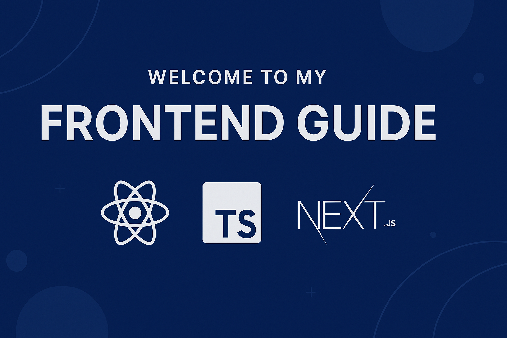

# Welcome to My Frontend Guide (:simple-react: :simple-typescript: :simple-nextdotjs:)

This guide will walk you through everything you need to know to build **modern**, **scalable**, and **type-safe** web applications using **React**, **TypeScript**, and **Next.js**.

---

## 📘 What You’ll Learn

You'll explore:

- ✅ Core React principles, history, and why it’s the UI library of choice.
- 🧱 How to build reusable components with JSX, props, state, and hooks.
- 🔄 The Virtual DOM and how React efficiently handles UI updates.
- ⚙️ Modern features like React Fiber, Concurrent Rendering, and Suspense.
- 🧠 TypeScript fundamentals and how it improves developer productivity.
- ✅ Typing React props, context, hooks, and reducers using TypeScript.
- 🧩 Combining React with TypeScript for scalable, bug-resistant code.
- 🚀 Building full-stack React apps with **Next.js**.
- 🧭 Mastering Next.js features: file-based routing, SSR, SSG, ISR, and Server Components.
- 🗃️ Using API routes, database integration, and deploying with Vercel.
- 🔁 Comparing React to other frameworks (Vue, Angular, Svelte).
