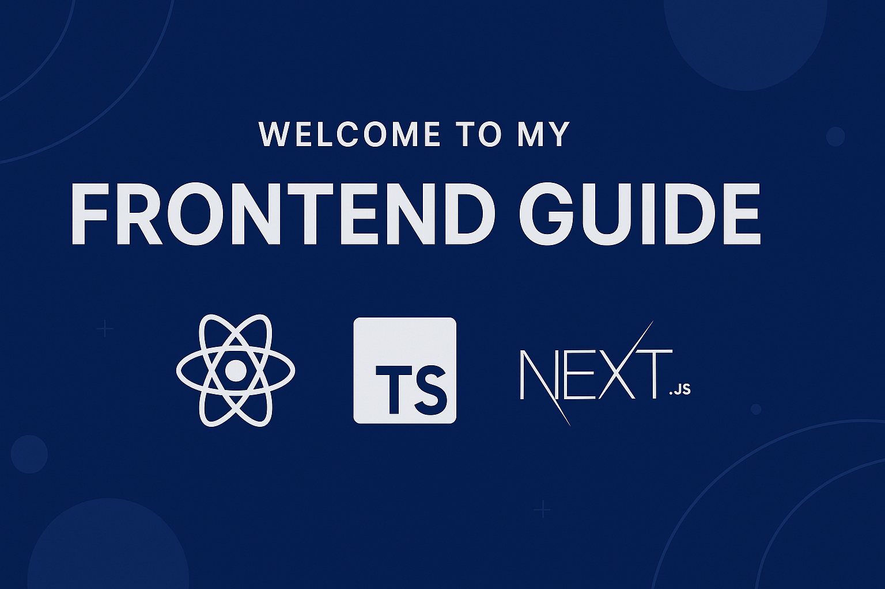

# Welcome to My Frontend Guide (:simple-react: :simple-typescript: :simple-nextdotjs:)

This guide will walk you through everything you need to know to build **modern**, **scalable**, and **type-safe** web applications using **React**, **TypeScript**, and **Next.js**.

---

## 📘 What You’ll Learn

You'll explore:

- ✅ Core React principles, history, and why it’s the UI library of choice.
- 🧱 How to build reusable components with JSX, props, state, and hooks.
- 🔄 The Virtual DOM and how React efficiently handles UI updates.
- ⚙️ Modern features like React Fiber, Concurrent Rendering, and Suspense.
- 🧠 TypeScript fundamentals and how it improves developer productivity.
- ✅ Typing React props, context, hooks, and reducers using TypeScript.
- 🧩 Combining React with TypeScript for scalable, bug-resistant code.
- 🚀 Building full-stack React apps with **Next.js**.
- 🧭 Mastering Next.js features: file-based routing, SSR, SSG, ISR, and Server Components.
- 🗃️ Using API routes, database integration, and deploying with Vercel.
- 🔁 Comparing React to other frameworks (Vue, Angular, Svelte).

---

## :simple-react: React: The UI Library

React is a powerful JavaScript library for building user interfaces, focusing on component-based architecture and a declarative approach.

**In this section, you’ll learn:**

- What React is and how it differs from other frameworks.
- Creating components with JSX.
- Using state and props to manage dynamic data.
- The power of hooks: `useState`, `useEffect`, `useContext`, and more.
- One-way data flow and how it simplifies app logic.
- The Virtual DOM and performance benefits.

---

## :simple-typescript: TypeScript: Static Typing for JavaScript

TypeScript adds **type safety** to JavaScript, helping you catch errors early and refactor confidently.

**You’ll learn:**

- TypeScript syntax: types, interfaces, enums, and generics.
- Type checking functions, arrays, objects, and more.
- Writing reusable, type-safe utilities and components.
- Working with external libraries and `@types`.
- Using `tsconfig.json` to customize your build settings.
- Setting up React + TypeScript projects.
- Typing props, state, refs, and context.
- Strongly typing `useReducer` and custom hooks.
- Handling form validation and API calls with TypeScript.
- Creating scalable patterns with reusable types.

---

## :simple-nextdotjs: Next.js: The React Framework

Next.js builds on React by adding routing, data fetching, API routes, and full-stack capabilities—all with great defaults and performance.

**With Next.js, you’ll learn:**

- App routing: pages vs App Router, dynamic and nested routes.
- Static Generation (SSG), Server-Side Rendering (SSR), and Incremental Static Regeneration (ISR).
- Server Components and client hydration in the new App directory.
- Creating API routes and integrating databases (e.g., Prisma).
- Authentication with NextAuth.js and using middleware.
- Optimizing and deploying to Vercel.

---

> Whether you're just starting out or leveling up, this guide gives you a solid foundation for building high-performance front-end applications.

## 📬 Get in touch

- Email: [souravkumardash183@gmail.com](mailto:souravkumardash183@gmail.com)
- Portfolio: [My Portfolio](https://souravkumardash.vercel.app)
- LinkedIn: [S.Kumar](https://www.linkedin.com/in/sourav183)
- GitHub: [Captain-Rengoku](https://github.com/Captain-Rengoku)
