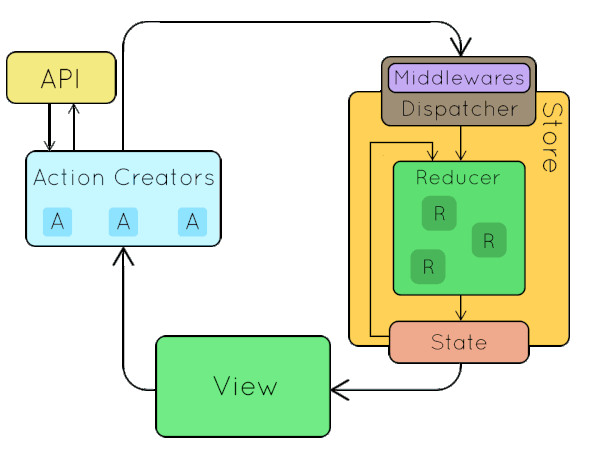

# Redux Toolkit (State Management)

- 1️⃣ Introduction to RTK

| Concept               | Description                                                                |
|-----------------------|----------------------------------------------------------------------------|
| What is RTK?          | Official, opinionated Redux library to simplify store setup and state logic. |
| Why RTK?              | Reduces boilerplate, handles async logic, integrates DevTools & middleware.|

---

- 2️⃣ Store Setup

| Concept               | Description                                           |
|-----------------------|-------------------------------------------------------|
| `configureStore`      | Creates the Redux store with preconfigured settings.  |
| `combineReducers`     | Combines multiple slices (used if needed).            |
| `Provider` Component  | Makes the store accessible to React components.       |

---

- 3️⃣ Slices: State + Actions + Reducers

| Concept         | Description                                                   |
|-----------------|---------------------------------------------------------------|
| `createSlice`   | Auto-generates actions and reducers from slice definition.    |
| `name`          | Name of the slice (used in action types).                     |
| `initialState`  | Initial state of the slice.                                   |
| `reducers`      | Synchronous state mutation logic.                             |
| `actions`       | Auto-generated action creators from reducer keys.             |

---

- 4️⃣ Accessing State and Dispatching Actions

| Concept         | Description                                      |
|-----------------|--------------------------------------------------|
| `useSelector`   | Read data from the Redux store.                  |
| `useDispatch`   | Dispatch actions from components.                |
| Selectors       | Pure functions to select parts of the state.     |

---

- 5️⃣ Async Logic with `createAsyncThunk`

| Concept             | Description                                                |
|---------------------|------------------------------------------------------------|
| `createAsyncThunk`  | Handles async logic and auto-generates action types.       |
| `pending`           | Triggered when the request starts.                         |
| `fulfilled`         | Triggered when the request succeeds.                       |
| `rejected`          | Triggered when the request fails.                          |
| `extraReducers`     | Used to handle these action states inside the slice.       |

---

- 6️⃣ RTK Query (Built-In Data Fetching)

| Concept          | Description                                                                 |
|------------------|-----------------------------------------------------------------------------|
| `createApi`      | Defines endpoints for fetching/mutating server data.                        |
| Auto Cache       | Automatically caches and invalidates queries.                               |
| Auto Hooks       | Generates hooks like `useGetPostsQuery`.                                    |
| Realtime Updates | Uses polling or WebSockets with `refetchOnMountOrArgChange`.                |

---

- 7️⃣ Entity Adapter

| Concept              | Description                                                        |
|----------------------|--------------------------------------------------------------------|
| `createEntityAdapter`| Manages normalized state with built-in CRUD helpers and selectors. |
| `setAll`, `addOne`   | Immutable helper functions to manage entity collections.           |
| `getSelectors`       | Returns optimized selectors like `selectById`, `selectAll`.        |
| **Normalized State** | Improves performance and simplifies updates.                       |

---

- 8️⃣ Middleware (Built-In and Custom)

| Middleware              | Purpose                                                                 |
|-------------------------|-------------------------------------------------------------------------|
| **Redux Thunk**         | Enables `createAsyncThunk` for async logic. Included by default in RTK. |
| **Listener Middleware** | React to specific actions outside reducers (side effects).              |
| **RTK Query Middleware**| Manages caching, invalidation, polling, and subscriptions.              |

---

- 9️⃣ Best Practices

| Practice                      | Why                                                                 |
|--------------------------------|---------------------------------------------------------------------|
| **Co-locate logic per feature**| Maintainable, modular structure.                                   |
| **Keep state normalized**      | Easier updates and caching.                                        |
| **Keep slices focused**        | Smaller, maintainable reducer logic.                               |
| **Use RTK Query for async data**| Handles caching and status automatically.                          |

---

- 🔟 Common RTK Techniques

| Technique                   | Description                                                            |
|-----------------------------|------------------------------------------------------------------------|
| **Selectors + useSelector** | Extract state efficiently with memoization.                            |
| **useDispatch + Thunks**    | Trigger async or complex actions from components.                      |
| **Component-level loading/error**| Show UI feedback based on request status.                          |
| **Error Handling via matchers**| Centralize error handling in `extraReducers`.                        |

---

## 1️⃣ Introduction to Redux

**🔹 What is Redux?**  
Redux is a predictable state container for JavaScript apps, often used with React to manage application-level state.

**🔹 Why Use Redux?**  
Redux helps manage complex state logic and enables easier debugging, testing, and scaling in large apps.

### ✅ Improvements in RTK Over Redux

- 🧱 **Less Boilerplate:** `createSlice()` handles action types, creators, and reducers together.
- ⚙️ **configureStore():** Simplifies store setup with good defaults.
- 🧠 **Immer Integration:** Allows mutation-like code while keeping state immutable.
- 🚀 **Built-in Async Support:** `createAsyncThunk()` handles API calls elegantly.
- 🧪 **RTK Query:** Powerful built-in solution for data fetching and caching.
- 🧰 **DevTools Ready:** Comes with Redux DevTools and middleware out-of-the-box.
- 🔐 **Strong Typing:** Native TypeScript support with clear types.

### **🔹 Redux Principles**

- **Single Source of Truth**: The state of your whole application is stored in an object tree within a single store.
- Single Source of Truth (SSOT) means all your application’s state is stored in one centralized place, typically in a global store like Redux.
- Instead of spreading state across multiple components, everything is managed from this single source.
- **State is Read-Only**: The only way to change the state is to emit an action.
- **Changes are Made with Pure Functions**: Reducers are pure functions that take the previous state and action and return the next state.

### **🔹 Comparing Redux with Context API**

| Feature              | Context API                        | Redux                             |
|----------------------|------------------------------------|-----------------------------------|
| Purpose              | Sharing simple global state        | Managing complex state            |
| Performance          | Re-renders all consumers           | Fine-grained updates              |
| DevTools             | No built-in tools                  | Time-travel, logging, inspection  |
| Middleware Support   | No                                 | Yes (Thunk, Saga, etc.)           |
| Boilerplate          | Less                               | More                              |

**Redux Flow Normal**


`onClick() --> hnaldeClick() --> Action Dispatch --> Store --> Reducer --> Logic Execute --> Store --> State Update --> UI Update`

**Redux Flow with API calls**


- go to RTK website first -- <https://redux-toolkit.js.org/>
- go to Store SetUp -- <https://redux-toolkit.js.org/api/configureStore>
- go to Reducers and Actions -- <https://redux-toolkit.js.org/api/createReducer>

- redux RTK install -- `npm install @reduxjs/toolkit`
- react bindings install -- `npm install react-redux`

---

## 🛠️ Redux Toolkit Basic Setup in React

Redux Toolkit (RTK) simplifies Redux development by reducing boilerplate and including useful utilities like `createSlice`, `configureStore`, and `createAsyncThunk`.

### 📁 Folder Structure (React)

```txt
src/
├── app/
│    └── store.js             # Configures and exports the Redux store with all slice reducers.
│
├── features/
│ └── todo/
│ |    ├── todoSlice.js       # Defines todo state, actions, and reducers using createSlice.
│ |    ├── todoAPI.js         # Handles API calls. (if using RTK Query or other async logic).
│ |    ├── todoSelectors.js   # Provides reusable selectors. (if you have complex selectors)
│ |    └── todoActions.js     # Action creators (Optional if needed separately)
│ |
│ └── user/
│      ├── userSlice.js       # Defines user state, login/logout actions, and reducers.
│      ├── userAPI.js         # Handles API calls. (if using RTK Query or other async logic)
│      ├── userSelectors.js   # Provides reusable selectors. (if you have complex selectors)
│      └── userActions.js     # Action creators (Optional if needed separately)
│
├── App.jsx      # Root React component that renders the main app layout.
└── main.jsx     # Application entry point that renders <App /> and wraps it in <Provider>.
```

### 1️⃣ Install Redux Toolkit and React-Redux

```bash
npm install @reduxjs/toolkit react-redux
```

### 2️⃣ Create a Slice

```js
//📄 src/features/counter/counterSlice.js
import { createSlice } from '@reduxjs/toolkit';

const initialState = {
  value: 0,
};

const counterSlice = createSlice({
  name: 'counter',
  initialState,
  reducers: {
    increment: (state) => {
      state.value += 1;
    },
    decrement: (state) => {
      state.value -= 1;
    },
    incrementByAmount: (state, action) => {
      state.value += action.payload;
    },
  },
});

export const { increment, decrement, incrementByAmount } = counterSlice.actions;
export default counterSlice.reducer;
```

### 3️⃣ Configure the Store

```js
//📄 src/app/store.js
import { configureStore } from '@reduxjs/toolkit';
import counterReducer from '../features/counter/counterSlice';

export const store = configureStore({
  reducer: {
    counter: counterReducer,
  },
});
```

### 4️⃣ Provide the Store to React Globally

```jsx
// 📄 src/main.jsx
import React from 'react';
import ReactDOM from 'react-dom/client';
import App from './App';
import { Provider } from 'react-redux';
import { store } from './app/store';

ReactDOM.createRoot(document.getElementById('root')).render(
  <React.StrictMode>
    <Provider store={store}>
      <App />
    </Provider>
  </React.StrictMode>
);
```

### 5️⃣ Use Redux State and Actions in Components

```jsx
//📄 src/features/counter/Counter.jsx
import React from 'react';
import { useSelector, useDispatch } from 'react-redux';
import { increment, decrement, incrementByAmount } from './counterSlice';

function Counter() {
  const count = useSelector((state) => state.counter.value);
  const dispatch = useDispatch();

  return (
    <div>
      <h2>Count: {count}</h2>
      <button onClick={() => dispatch(increment())}>+1</button>
      <button onClick={() => dispatch(decrement())}>-1</button>
      <button onClick={() => dispatch(incrementByAmount(5))}>+5</button>
    </div>
  );
}

export default Counter;
```

### 6️⃣ Use the Component

```jsx
//📄 src/App.jsx
import React from 'react';
import Counter from './features/counter/Counter';

function App() {
  return (
    <div>
      <h1>Redux Toolkit Example</h1>
      <Counter />
    </div>
  );
}

export default App;
```

---

## 🧩 Redux Toolkit + React + TypeScript Setup

Using Redux Toolkit with TypeScript gives you full type safety and better developer experience when managing state.

### 📁 Folder Structure React TypeScript

```txt
src/
├── app/
│ └── store.ts
│
├── features/
│ └── counter/
│ ├── counterSlice.ts
│ └── Counter.tsx
│
├── App.tsx
└── main.tsx
```

### 1️⃣ Install Redux Toolkit, React-Redux and types

```bash
npm install @reduxjs/toolkit react-redux
npm install --save-dev @types/react-redux
```

### 2️⃣ Create a Slice with Types

```ts
//📄 src/features/counter/counterSlice.ts
import { createSlice, PayloadAction } from '@reduxjs/toolkit';

interface CounterState {
  value: number;
}

const initialState: CounterState = {
  value: 0,
};

const counterSlice = createSlice({
  name: 'counter',
  initialState,
  reducers: {
    increment: (state) => {
      state.value += 1;
    },
    decrement: (state) => {
      state.value -= 1;
    },
    incrementByAmount: (state, action: PayloadAction<number>) => {
      state.value += action.payload;
    },
  },
});

export const { increment, decrement, incrementByAmount } = counterSlice.actions;
export default counterSlice.reducer;
```

### 3️⃣ Configure the Store with Types

```ts
//📄 src/app/store.ts
import { configureStore } from '@reduxjs/toolkit';
import counterReducer from '../features/counter/counterSlice';

export const store = configureStore({
  reducer: {
    counter: counterReducer,
  },
});

// Infer RootState and AppDispatch types from the store
export type RootState = ReturnType<typeof store.getState>;
export type AppDispatch = typeof store.dispatch;
```

### 4️⃣ Setup Typed Hooks

```ts
// 📄 src/app/hooks.ts
import { TypedUseSelectorHook, useDispatch, useSelector } from 'react-redux';
import type { RootState, AppDispatch } from './store';

export const useAppDispatch: () => AppDispatch = useDispatch;
export const useAppSelector: TypedUseSelectorHook<RootState> = useSelector;
```

### 5️⃣ Provide the Store Globally

```tsx
//📄 src/main.tsx
import React from 'react';
import ReactDOM from 'react-dom/client';
import App from './App';
import { Provider } from 'react-redux';
import { store } from './app/store';

ReactDOM.createRoot(document.getElementById('root')!).render(
  <React.StrictMode>
    <Provider store={store}>
      <App />
    </Provider>
  </React.StrictMode>
);
```

### 6️⃣ Use Redux in a Component with TypeScript

```tsx
//📄 src/features/counter/Counter.tsx
import React from 'react';
import { useAppDispatch, useAppSelector } from '../../app/hooks';
import { increment, decrement, incrementByAmount } from './counterSlice';

const Counter: React.FC = () => {
  const count = useAppSelector((state) => state.counter.value);
  const dispatch = useAppDispatch();

  return (
    <div>
      <h2>Count: {count}</h2>
      <button onClick={() => dispatch(increment())}>+1</button>
      <button onClick={() => dispatch(decrement())}>-1</button>
      <button onClick={() => dispatch(incrementByAmount(5))}>+5</button>
    </div>
  );
};

export default Counter;
```

- import it to App.tsx

```tsx
//📄 src/App.tsx
import React from 'react';
import Counter from './features/counter/Counter';

const App: React.FC = () => {
  return (
    <div>
      <h1>Redux Toolkit + TypeScript</h1>
      <Counter />
    </div>
  );
};

export default App;
```

---

## 5️⃣ Async Logic with `createAsyncThunk`

### ✅ Latest & Recommended RTK Folder Structure and Process

```txt
src/
├── app/
│    └── store.js
├── features/
│    └── users/
│         ├── usersSlice.js        # Slice + async thunk inside
│         ├── usersAPI.js          # API calls (optional if small, else inline in thunk)
│         ├── usersSelectors.js    # Selectors (optional if small, can be inside slice)
│         └── index.js             # (Optional) re-export everything from here
├── components/
│    └── UsersList.jsx
└── main.jsx
```

#### First Define the API

```js
// src/features/users/usersAPI.js
export const fetchUsersAPI = async () => {
  const res = await fetch("https://jsonplaceholder.typicode.com/users");
  if (!res.ok) throw new Error("Failed to fetch the users");
  return await res.json();
};
```

#### createAsyncThunk – What is it?

- createAsyncThunk is a helper from RTK that simplifies handling asynchronous operations like API requests.
- It automatically generates action types and handles pending, fulfilled, and rejected states.
- returns a function instead of an action.

✅ Benefits of createAsyncThunk

- 📦 Bundles async flow into one utility
- ✅ Auto-generates action types
- 📘 Clean and readable logic
- 🔒 Strong typing support (with TypeScript)

🔄 Behind the Scenes It generates 3 actions:

- users/fetchPosts/pending
- users/fetchPosts/fulfilled
- users/fetchPosts/rejected

#### Use `createAsyncThunk` and handle extra reducers via `extraReducers` in usersSlice.js

🧩 Using in extraReducers

```js
//src/features/users/usersSlice.js
import { createSlice, createAsyncThunk } from "@reduxjs/toolkit";
import { fetchUsersAPI } from "./usersAPI";

export const fetchUsers = createAsyncThunk("users/fetchUsers", async () => {
  return await fetchUsersAPI();
});

const usersSlice = createSlice({
  name: "usersmodern",
  initialState: {
    list: [],
    status: "idle",
    error: null,
  },
  reducers: {},
  extraReducers: (builder) => {
    builder
      .addCase(fetchUsers.pending, (state) => {
        state.status = "loading";
      })
      .addCase(fetchUsers.fulfilled, (state, action) => {
        state.status = "succeeded";
        state.list = action.payload;
      })
      .addCase(fetchUsers.rejected, (state, action) => {
        state.status = "failed";
        state.error = action.error.message;
      });
  },
});

export default usersSlice.reducer;
```

#### Export the selectors to access the state easely

```js
//src/features/users/usersSelectors.js
export const selectAllUsers = (state) => state.usersmodern.list;
export const selectUsersStatus = (state) => state.usersmodern.status;
export const selectUsersError = (state) => state.usersmodern.error;
```

#### Add it to the Store

```js
//src/app/store.js
import { configureStore } from '@reduxjs/toolkit';
import usersReducer from '../features/users/usersSlice';

export const store = configureStore({
  reducer: {
    users: usersReducer,
  },
});
```

#### Use in Component

```jsx
//src/components/UsersList.jsx
import React, { useEffect } from "react";
import { useDispatch, useSelector } from "react-redux";
import { fetchUsers } from "../features/users/usersSlice";
import {
  selectAllUsers,
  selectUsersStatus,
  selectUsersError,
} from "../features/users/usersSelectors";

export default function UsersList() {
  const dispatch = useDispatch();
  const users = useSelector(selectAllUsers);
  const status = useSelector(selectUsersStatus);
  const error = useSelector(selectUsersError);

  useEffect(() => {
    if (status === "idle") {
      dispatch(fetchUsers());
    }
  }, [status, dispatch]);

  return (
    <div className="p-6">
      <h2 className="text-2xl font-bold mb-4">Users List</h2>

      {status === "loading" && <p className="text-blue-500">Loading...</p>}
      {status === "failed" && (
        <p className="text-red-500">Error: {error}</p>
      )}
      {status === "succeeded" && (
        <div className="grid grid-cols-1 md:grid-cols-2 lg:grid-cols-3 gap-4">
          {users.map((user) => (
            <div
              key={user.id}
              className="p-4 bg-green-100 shadow rounded-lg border"
            >
              <h3 className="text-black text-lg font-semibold">{user.name}</h3>
              <p className="text-gray-600">{user.email}</p>
              <p className="text-sm text-gray-500">{user.company.name}</p>
            </div>
          ))}
        </div>
      )}
    </div>
  );
}
```

### ✅ Latest & Minimal RTK Structure and Process

```txt
src/
 ├── app/
 │    └── store.js
 ├── features/
 │    └── users/
 │         └── usersSlice.js        # Slice + async thunk + initial state
 ├── components/
 │    └── UsersList.jsx
 ├── App.jsx
 └── main.jsx
```

#### First Define the usersSlice.js

```js
//src/features/users/usersSlice.js
import { createSlice, createAsyncThunk } from '@reduxjs/toolkit';

export const fetchUsers = createAsyncThunk(
  'users/fetchUsers',
  async () => {
    const res = await fetch('https://jsonplaceholder.typicode.com/users');
    if (!res.ok) throw new Error('Failed to fetch users');
    return res.json();
  }
);

const usersSlice = createSlice({
  name: 'users',
  initialState: {
    data: [],
    loading: false,
    error: null,
  },
  reducers: {},
  extraReducers: (builder) => {
    builder
      .addCase(fetchUsers.pending, (state) => {
        state.loading = true;
        state.error = null;
      })
      .addCase(fetchUsers.fulfilled, (state, action) => {
        state.loading = false;
        state.data = action.payload;
      })
      .addCase(fetchUsers.rejected, (state, action) => {
        state.loading = false;
        state.error = action.error.message;
      });
  },
});

export default usersSlice.reducer;
```

#### Add it in store

```js
//src/app/store.js
import { configureStore } from '@reduxjs/toolkit';
import usersReducer from '../features/users/usersSlice';

export const store = configureStore({
  reducer: {
    users: usersReducer,
  },
});
```

#### Create the Component

```jsx
//src/components/UsersList.jsx
import { useEffect } from 'react';
import { useDispatch, useSelector } from 'react-redux';
import { fetchUsers } from '../features/users/usersSlice';

export default function UsersList() {
  const dispatch = useDispatch();
  const { data, loading, error } = useSelector((state) => state.users);

  useEffect(() => {
    dispatch(fetchUsers());
  }, [dispatch]);

  if (loading) return <p className="text-blue-500">Loading...</p>;
  if (error) return <p className="text-red-500">{error}</p>;

  return (
    <div className="p-4 grid grid-cols-1 gap-4">
      {data.map((user) => (
        <div key={user.id} className="p-4 border rounded-lg shadow hover:shadow-lg transition">
          <h2 className="font-bold text-lg">{user.name}</h2>
          <p className="text-gray-600">{user.email}</p>
          <p className="text-gray-500 text-sm">{user.company.name}</p>
        </div>
      ))}
    </div>
  );
}
```

---

## 6️⃣ RTK Query (Built-In Data Fetching)

- Install JSON Server and axios for learning here only
- `npm i axios` and `npm i json-server`

- Then go to -- <https://www.npmjs.com/package/json-server>
- To learn the commands of json-server
- To run the server `npx json-server db.json`
- Run `json-server --help` for a list of options

- Now run the server using `npx json-server db.json`

### create a service file in services

```js
//src/services/localJsonServerUserApi.js
import { createApi, fetchBaseQuery } from "@reduxjs/toolkit/query/react";

export const localJsonServerUserApi = createApi({
    // reducerPath is the string name to represent our API, whenever we want to get the data from it.
    reducerPath: 'api',
    // baseQuery is the initial base URL to the API we are using
    baseQuery: fetchBaseQuery({
        baseUrl: "http://localhost:3000/"
    }),

    // Cache the data for 20 sec
    // keepUnusedDataFor: 20,

    endpoints: (builder) => ({
        // Query and fetch the users
        // getUsers: builder.query({query: (id) => `users/${id}`}),
        getUsers: builder.query({ query: () => "users" }),
        // for specific query cache
        // getUsers: builder.query({query: () => "users", keepUnusedDataFor: 5}),

        // Add an user and Update the users
        AddUser: builder.mutation({
            query: (newUser) => ({
                url: "users",
                method: "POST",
                body: newUser,
            })
        }),
    })
})

// you must write -- use + 'Query Name' + Query
// you must write -- use + 'Mutation Name' + Mutation
export const { useGetUsersQuery, useAddUserMutation } = localJsonServerUserApi;
```

### Add it to store

```js
// src/app/store.js
import {configureStore} from '@reduxjs/toolkit'
// imports for redux query
import { setupListeners } from '@reduxjs/toolkit/query'
import { localJsonServerUserApi } from '../services/localJsonServerUserApi'

// Create the Store
export const store = configureStore({
    reducer: {
        // For APIs using Redux Query
        // For API using JSONServer
        [localJsonServerUserApi.reducerPath]: localJsonServerUserApi.reducer,
    },
    // middleware
    // it enables caching, automatic refetching, and request lifecycle handling.
    // Without it, your queries and mutations won’t work properly even if the reducers are set up.
    middleware: (getDefaultMiddleware) =>
        getDefaultMiddleware()
            // middleware for APIs using Redux Query for localhost json server
            .concat(localJsonServerUserApi.middleware)
});

// setupListeners
setupListeners(store.dispatch);
```

### use in any component

```jsx
// src/components/JsonServerUserWithReduxQuery.jsx
import { useState } from 'react'
import { useAddUserMutation, useGetUsersQuery } from '../services/localJsonServerUserApi'

const JsonSeverUserWithReactQuery = () => {
    const [formData, setFormData] = useState({name: '', email: ''});
    const [addUser] = useAddUserMutation();
    // to refetch the users at some specific time use refetch 
    const { data: users, isLoading, error, refetch } = useGetUsersQuery()
    if (isLoading) return <div>Loading...</div>
    if (error) return <div>There was an error :( : {error.message}</div>
    
    const handleChange = (e) => {
        e.preventDefault();
        setFormData({
            ...formData,
            [e.target.name]: e.target.value,
            [e.target.email]: e.target.email,
        })
    }

    const handleSubmit = async (e) => {
        e.preventDefault();
        if (!formData.name || !formData.email) return;
        await addUser(formData);
        // to refetch the users data after you create a post use refetch()
        refetch();
        setFormData({name: '', email: ''})
    }

    return (
        <div className='text-white'>
            <h2 className='text-2xl text-indigo-400'>
                To use this component first run the JSON Server in another terminal <br />
                use this command -- <span className='text-blue-500'>npx json-server db.json</span> <br />
                Then open localhost 3000 to see changes
            </h2>
            <h2 className='text-2xl my-6'> User Form</h2>
            <form 
                className='flex flex-col gap-4 bg-gray-700 p-4 m-8 w-fit 
                items-center mx-auto rounded-lg'
                onSubmit={handleSubmit}
            >
                <input
                    name='name'
                    className='p-2 bg-zinc-900 rounded-lg'
                    type="text"
                    placeholder='Enter your name'
                    value={formData.name}
                    // onChange={(e) => setFormData({...formData, name: e.target.value})}
                    onChange={handleChange} // better for dynamic keys
                    />
                <input
                    name='email'
                    className='p-2 bg-zinc-900 rounded-lg'
                    type="email"
                    placeholder='Enter your email'
                    value={formData.email}
                    // onChange={(e) => setFormData({...formData, email: e.target.value})}
                    onChange={handleChange} // better for dynamic keys
                />
                <button type='submit'>Log In</button>
            </form>
            <h2 className='text-2xl my-6'> User List</h2>
            <ul className='list-decimal text-start space-y-2'>
                {users.map(user => (
                    <li key={user.id} className='p-2 bg-gray-700 rounded'>
                        {user.name} - {user.email}
                    </li>
                ))}
            </ul>
        </div>
    )
}

export default JsonSeverUserWithReactQuery
```

### **Difference between Redux Thunk and Redux Query**

| Feature              | **Redux Thunk**                                                                                               | **RTK Query**                                                                       |
| -------------------- | ------------------------------------------------------------------------------------------------------------- | ----------------------------------------------------------------------------------- |
| **Purpose**          | General-purpose middleware for async logic in Redux (e.g., API calls, delayed actions, conditional dispatch). | Specialized data fetching & caching tool built into Redux Toolkit.                  |
| **Boilerplate**      | More boilerplate — you manually write actions, reducers, and async logic.                                     | Minimal boilerplate — just define API endpoints, and hooks are auto-generated.      |
| **Caching**          | No caching out of the box (you must implement manually).                                                      | Built-in caching, deduplication, and automatic background refetching.               |
| **Data Management**  | You manage state manually in reducers.                                                                        | Automatically stores API data in Redux state and updates UI.                        |
| **Flexibility**      | Can handle **any kind of async work**, not just fetching.                                                     | Optimized for CRUD-style API calls; not ideal for unrelated async logic.            |
| **Setup Complexity** | More manual wiring needed.                                                                                    | Faster setup for API-driven apps.                                                   |
| **When to Use**      | If your async work is not mainly API fetching, or if you want **full control** over Redux flow.               | If your app’s main async work is **API calls** and you want caching + auto updates. |

### **Summary**

- Redux Thunk is a general-purpose async middleware — you can use it for any asynchronous logic, not just API calls.

- RTK Query is specialized for API fetching and caching — it’s built into Redux Toolkit and is much faster to set up for data fetching.

- If your async logic = mostly API fetching → RTK Query can replace Thunk.

- If your async logic = more than just API calls → You might still need Thunk alongside RTK Query.

## 7️⃣ Entity Adapter

### 📌 What is an Entity Adapter?

- An Entity Adapter in Redux Toolkit is a utility from @reduxjs/toolkit that helps you manage collections of items in normalized form.
- For small to medium apps with RTK Query handling data fetching: 2/10 (rarely needed)
- For large apps with complex caching, relational data, or offline editing: 8/10 (very useful)

## 8️⃣ Middleware (Built-In and Custom)

### What is Redux Middleware?

- Middleware in Redux is like a checkpoint between dispatching an action and the reducer updating the state.
- It can intercept, log, modify, delay, or even stop actions before they reach the reducers.

- `dispatch(action) → [middleware pipeline] → reducer → store update`

### Why Middleware Exists

- Without middleware, Redux only supports synchronous actions.
Middleware enables:
  - Async actions (e.g., API calls with Redux Thunk, RTK Query)
  - Logging & debugging (e.g., redux-logger)
  - 1️⃣ redux-thunk
    - `Purpose` → Allows dispatching asynchronous actions (functions) instead of plain objects.
    - `Usage` → Fetching data from an API before updating the store.
    - `Why Popular?` → Simple, built-in with RTK, works for most async needs.
  - 2️⃣ redux-logger (alternatively we simply use redux DevTools)
    - `Purpose` → Logs actions and state changes in the console for debugging.
    - `Usage` → Easy to see what actions are dispatched and how state changes.
    - `Why Popular?` → Great for development debugging.
  - 3️⃣ RTK Query middleware
    - `Purpose` → Handles caching, data fetching, and invalidation automatically.
    - `Usage` → Added when using createApi in Redux Toolkit Query.
    - `Why Popular?` → Reduces boilerplate for async API calls.
  - 4️⃣ Custom middleware
    - `Purpose` → Intercept or modify actions before they reach reducers.
    - `Usage` → Analytics tracking, logging to a file, API error handling.

## 9️⃣ Best Practices

- **Co-locate logic per feature**  
      - Keep slice, components, styles, and tests for a feature in the same folder.  
      - Makes finding and updating code easier.

- **Keep state normalized**  
      - Store data by IDs instead of nesting objects deeply.  
      - Improves update performance and makes lookups faster.

- **Example of normalized state**  

```js
users: { 1: { id: 1, name: "Alice" } }
posts: { 101: { id: 101, text: "Hi", userId: 1 } }
```

- **Keep slices focused**
      - One slice should handle one specific domain (users, products, orders).
      - Prevents giant, hard-to-maintain files.

- **Use RTK Query for async data**
      - Handles loading, error, caching, and re-fetching automatically.
      - Reduces boilerplate and keeps slices clean.

**Result**
      - Your Redux code will be organized, maintainable, fast, and less buggy.

## 🔟 Common RTK Techniques

1. **Selectors + useSelector**  
   Use selectors to read state from Redux.  
   Combine with `useSelector` to subscribe components only to what they need, improving performance.

2. **useDispatch + Thunks**  
   Use `useDispatch` to send actions, and thunks for async logic (like API calls).  
   Keeps components clean by moving side effects into thunks.

3. **Component-level loading/error**  
   Show loading spinners or error messages based on request status in state.  
   Improves user experience with clear feedback.

4. **Error Handling via matchers**  
   Use `addMatcher` in `extraReducers` to handle errors from multiple thunks in one place.  
   Reduces repetitive error-handling code.
