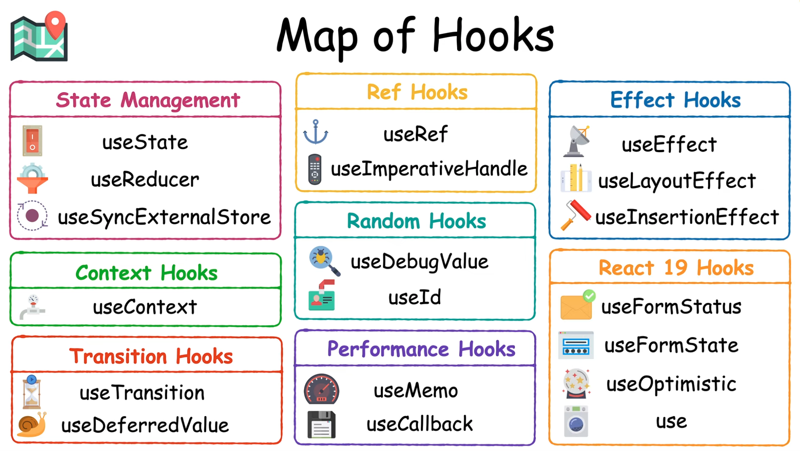

# React Hooks (Fundamentals & Advanced)

---

## **1.Introduction to Hooks**



### Why Hooks Were Introduced

Before React Hooks, functional components were stateless, and all stateful logic had to be handled in class components.
Hooks allow functional components to use state and lifecycle features, leading to:

- **Better Code Reusability**: Hooks let you extract component logic into reusable functions.
- **Easier State Management**: Avoid complex class-based lifecycle methods.
- **Reduced Boilerplate**: No need to bind `this` in class components.

### Component LifeCycle Status

- Lifecycle methods manage a component’s behavior at different stages (mounting, updating, unmounting).
- Let's compare how lifecycle works in JavaScript, React class components, and functional components using Hooks.

- **Counter in Vanilla JavaScript**
      - In plain JavaScript, there's no built-in state management like React.
      - You typically manage state using variables, functions, and event listeners.
          - window.onload → Runs when the page loads
          - setInterval / setTimeout → Mimic state updates
          - window.onunload → Runs when the page closes

    ```html
    <!DOCTYPE html>
    <html>
    <head>
      <title>Lifecycle Example</title>
    </head>
    <body>
      <div id="app"></div>
    
      <script>
        function createComponent() {
          let count = 0;
          const app = document.getElementById("app");
    
          function render() {
            app.innerHTML = `<p>Count: ${count}</p><button id="btn">Increment</button>`;
            document.getElementById("btn").addEventListener("click", increment);
          }
    
          function increment() {
            count++;
            render();
          }
    
          // Simulating component mount
          window.onload = () => {
            console.log("Component Mounted");
            render();
          };
    
          // Simulating component unmount
          window.onunload = () => {
            console.log("Component Unmounted");
          };
        }
    
        createComponent();
      </script>
    </body>
    </html>
    ```

- Problems in Vanilla JS:
      - Manual DOM manipulation → Hard to maintain
      - Global event listeners → Risk of memory leaks
      - No clear lifecycle separation

- **State and Lifecycle in React Class Components**
      - React introduced state and lifecycle methods to handle dynamic data updates and component behavior over time.
      - `State in Class Components`
        - State is a built-in object that allows a component to store and manage data dynamically.
        - It is updated using `setState()`
      - `Lifecycle Methods in Class Components`
        - Lifecycle methods help execute code at specific points in a component’s lifecycle:
            - `componentDidMount()`: Runs after component mounts (good for API calls).
            - `componentDidUpdate()`: Runs when the component updates.
            - `componentWillUnmount()`: Runs before component is destroyed.

    ```jsx
    import React, { Component } from "react";
    
    class LifecycleDemo extends Component {
      constructor(props) {
        super(props);
        this.state = { count: 0 };
        console.log("Constructor: Component is initialized");
      }
    
      componentDidMount() {
        console.log("componentDidMount: Component mounted");
      }
    
      componentDidUpdate() {
        console.log("componentDidUpdate: State updated");
      }
    
      componentWillUnmount() {
        console.log("componentWillUnmount: Cleanup before unmounting");
      }
    
      increment = () => {
        this.setState((prevState) => ({ count: prevState.count + 1 }));
      };
    
      render() {
        console.log("Render: Component is rendering");
        return (
          <div>
            <p>Count: {this.state.count}</p>
            <button onClick={this.increment}>Increment</button>
          </div>
        );
      }
    }
    
    export default LifecycleDemo;
    ```

- How it happens
      - Mounting: constructor() → componentDidMount()
      - Updating: render() → componentDidUpdate()
      - Unmounting: componentWillUnmount()

- **State and Lifecycle in React Hooks (Functional Components)**
      - React Hooks replace class-based state and lifecycle methods in functional components.
      - Key Hooks for State and Lifecycle
          - `useState()`: Manages state.
          - `useEffect()`: Handles lifecycle events like `componentDidMount`, `componentDidUpdate`, and `componentWillUnmount`.

    ```jsx
    import React, { useState, useEffect } from "react";
    
    function LifecycleDemo() {
      const [count, setCount] = useState(0);
    
      useEffect(() => {
        console.log("Component Mounted");
        
        return () => {
          console.log("Component Will Unmount");
        };
      }, []); // Runs once on mount & cleanup on unmount
    
      useEffect(() => {
        console.log("Component Updated: Count changed");
      }, [count]); // Runs when `count` changes
    
      return (
        <div>
          <p>Count: {count}</p>
          <button onClick={() => setCount(count + 1)}>Increment</button>
        </div>
      );
    }
    
    export default LifecycleDemo;
    ```

### Rules of Hooks

- **Only Call Hooks at the Top Level**: Do not use hooks inside loops, conditions, or nested functions.

    ```jsx
    function Counter() {
      const [count, setCount] = useState(0); // Hook at the top level
    
      return (
        <div>
          <p>Count: {count}</p>
          <button onClick={() => setCount(count + 1)}>Increment</button>
        </div>
      );
    }
    ```

    ```jsx
    function Counter() {
      const [count, setCount] = useState(0);
    
      if (count > 5) {
        const [highCount, setHighCount] = useState(true); // ❌ Hook inside condition
      }
    
      return <button onClick={() => setCount(count + 1)}>Click</button>;
    }
    ```

- **Only Call Hooks from React Functions**: Hooks should be used inside React function components or custom hooks.

    ```jsx
    function useCounter() { // Custom Hook
      const [count, setCount] = useState(0);
      return { count, setCount };
    }
    
    function Counter() { // Hook inside a React component
      const { count, setCount } = useCounter();
    
      return (
        <div>
          <p>Count: {count}</p>
          <button onClick={() => setCount(count + 1)}>Increment</button>
        </div>
      );
    }
    ```

    ```jsx
    function notAComponent() {
      const [count, setCount] = useState(0); // ❌ Hook inside a normal function
    }
    ```

### Migrating from Class Components to Hooks

- Example of converting a class component to a functional component with hooks:

```jsx
// Class Component
class Counter extends React.Component {
  constructor(props) {
    super(props);
    this.state = { count: 0 };
  }

  increment = () => {
    this.setState({ count: this.state.count + 1 });
  };

  render() {
    return (
      <div>
        <p>Count: {this.state.count}</p>
        <button onClick={this.increment}>Increment</button>
      </div>
    );
  }
}
```

```jsx
// Functional Component with Hooks
import { useState } from "react";

function Counter() {
  const [count, setCount] = useState(0);

  return (
    <div>
      <p>Count: {count}</p>
      <button onClick={() => setCount(count + 1)}>Increment</button>
    </div>
  );
}
```

---

## **2.useState Hook**

The useState hook is used to manage state in functional components.

### Initializing State

- When using useState, you provide an initial value for the state variable.
- This value is used only during the first render.

```jsx
const [count, setCount] = useState(0);
```

### Updating State Correctly

- State updates do not merge automatically in functional components (unlike class components).
- You must ensure you update the state properly.

```jsx
setCount(count + 1); // Incorrect Way ❌
```

- Why is this bad?
      - React does not batch updates when called multiple times in a single render cycle.
      - If multiple updates rely on the previous state, they may overwrite each other.

### Functional Updates

If the new state depends on the previous state, use a function inside setState.
This ensures correct updates when state updates occur asynchronously.

```jsx
setCount(prevCount => prevCount + 1);
```

- Why is this better?
      - prevCount always holds the latest state value.
      - Ensures correct updates even if setCount is called multiple times.

```jsx
const handleClick = () => {
  setCount(prev => prev + 1);
  setCount(prev => prev + 1);
  setCount(prev => prev + 1);
};
```

### Lazy Initialization

- If the initial state requires an expensive computation, you can pass a function to useState.
- This function runs only once, during the initial render.

```jsx
const [count, setCount] = useState(() => {
  return expensiveCalculation();
});
```

```jsx
function expensiveCalculation() {
  console.log("Running expensive computation...");
  return 100; // Assume this is an expensive operation
}

function Counter() {
  const [count, setCount] = useState(() => expensiveCalculation());

  return (
    <div>
      <p>Count: {count}</p>
      <button onClick={() => setCount(count + 1)}>Increment</button>
    </div>
  );
}

export default Counter;
```

---

## **3.useEffect Hook**

- The useEffect hook allows you to perform side effects in function components, such as:
      - Fetching data when a component is mounted or updated
      - Subscribing to events when a component is mounted or updated
      - Updating the DOM when a component is mounted or updated
      - Setting up timers when a component is mounted or updated

- Component Lifecycle - initialization, Mounting, Updation, Unmounting.
`useEffect(setup, dependencies)`

- **After mounting**
    Empty array as dependency []

    ```jsx
    useEffect(()=>{
      console.log("Counter Mounted");
    }, [])
    ```

- **After Unmounting**
    Empty array as dependency [] also known as cleanup function

    ```jsx
    useEffect(()=>{
      console.log("Counter Mounted");
      // when return a function it will run at the time of unmount only
      return function () {
        console.log("Unmount counter");
      }
    }, [])
    ```

- **After Updation**
    State as dependency [state]

    ```jsx
    useEffect(()=> {
      console.log("Counter Updated");
      // when return a fucntion with dependency array it will run at the time of unmount at the prevState unmount.
      return () => {
        console.log("Counter UseEffect Return")
      }
    },[count])
    ```

### Running Side Effects After Rendering

- By default, useEffect runs after every render.
- It can be used to synchronize state with external systems like:
      - Updating the document title
      - Fetching data
      - Interacting with browser APIs

```jsx
import React, { useState, useEffect } from "react";

function Counter() {
  const [count, setCount] = useState(0);

  useEffect(() => {
    document.title = `Count: ${count}`;
  }, [count]); // Runs when `count` changes

  return (
    <div>
      <p>Count: {count}</p>
      <button onClick={() => setCount(count + 1)}>Increment</button>
    </div>
  );
}

export default Counter;
```

- The effect updates the document title whenever count changes.
- Dependency array [count] ensures the effect runs only when count updates, not on every render.

### Cleaning Up Effects

- When using effects like timers, event listeners, or subscriptions, you should  clean them up to prevent:
      - Memory leaks (especially in long-running applications)
      - Unnecessary computations when the component unmounts or updates

- **Cleaning Up an Interval**

```jsx
import React, { useState, useEffect } from "react";

function Timer() {
  const [count, setCount] = useState(0);

  useEffect(() => {
    const interval = setInterval(() => {
      setCount((c) => c + 1);
    }, 1000);

    return () => clearInterval(interval); // Cleanup function
  }, []); // Runs only once (on mount)

  return <p>Timer: {count} seconds</p>;
}

export default Timer;
```

- setInterval runs every second.
- The cleanup function (clearInterval) ensures the timer stops when the component unmounts.

### Dependencies in useEffect

- The dependency array controls when the effect runs:
      - `No dependencies` → Runs on every render.
      - `Empty array ([])` → Runs only on mount & unmount.
      - `Specific dependencies ([var])` → Runs when those dependencies change.

Ensure dependencies are correctly specified to avoid unintended behavior.

```jsx
import React, { useState, useEffect } from "react";

function UserProfile({ userId }) {
  const [user, setUser] = useState(null);

  useEffect(() => {
    async function fetchUserData() {
      const response = await fetch(`https://jsonplaceholder.typicode.com/users/${userId}`);
      const data = await response.json();
      setUser(data);
    }

    fetchUserData();
  }, [userId]); // Runs only when `userId` changes

  return (
    <div>
      {user ? <h2>{user.name}</h2> : <p>Loading...</p>}
    </div>
  );
}

export default UserProfile;
```

---

## **4.useRef Hook**

- The useRef hook in React is a powerful tool that allows you to directly access and interact with DOM elements, as well as store values without causing re-renders.

- It does not cause a re-render atall.
- It can update the value though.

### Accessing DOM Elements

- One common use of useRef is to get direct access to a DOM element, such as an input field.

```jsx
const inputRef = useRef(null);
<input ref={inputRef} />
```

```jsx
import { useRef } from "react";

function FocusInput() {
  const inputRef = useRef(null); // Step 1: Create a reference

  const focusInput = () => {
    inputRef.current.focus(); // Step 3: Use the reference to focus the input
  };

  return (
    <div>
      <input ref={inputRef} type="text" placeholder="Type here..." /> {/* Step 2: Attach the reference */}
      <button onClick={focusInput}>Focus Input</button>
    </div>
  );
}

export default FocusInput;
// It will focus the input box when clicked on the button
```

```jsx
import { useEffect, useRef } from "react";

export default function Demo() {
  const inputRef = useRef(null); // Corrected useRef syntax

  useEffect(() => {
    inputRef.current?.focus(); // Focus the input field when the component mounts
  }, []);

  return (
    <div className="tutorial">
      <input ref={inputRef} type="text" placeholder="Type something..." />
    </div>
  );
}
// It will only focus the input box when first mounted
```

```jsx
import { useRef, useState } from "react";

export default function Demo() {
  const [count, setCount] = useState(0);
  const countRef = useRef(0);

  const handleIncrement = () => {
    setCount(count + 1);
    countRef.current++;

    console.log("State:", count); // State: 0
    // Console log will access the previous State because it is running on previous State
    // when cliked the button State will be updated but in the next render
    console.log("Ref:", countRef.current); // State: 1
    // The countRef value will be immediately change to 1 from 0
    // But we can't see because useRef does not re-renders the component.
  };

  return (
    <div className="tutorial">
      Count: {countRef.current} 
      {/*It will change because of useState rerender not because of useRef.*/}
      <button onClick={handleIncrement}>Increment</button>
    </div>
  );
}
```

```jsx
import React, { useRef, useState } from "react";

const RefCounter = () => {
  const countRef = useRef(0);
  const [state, setState] = useState(0);

  const incrementRef = () => {
    countRef.current += 1;
    console.log("Ref Count:", countRef.current);
  };

  return (
    <div>
      <h2>Ref Counter</h2>
      <p>Ref Count (no re-render): {countRef.current}</p>
      <p>State Value: {state}</p>
      <button onClick={incrementRef}>Increment Ref</button>
      <button onClick={() => setState(state + 1)}>Update State</button>
    </div>
  );
};

export default RefCounter;
```

- Clicking "Increment Ref" updates countRef.current, but the UI does not update.
- The new value only appears in the console (console.log).
- Clicking "Update State" triggers a re-render, and only then does countRef.current reflect the updated value.

### Persisting Values Without Re-renders

- The useRef hook in React allows you to persist values across renders without causing re-renders.

```jsx
const countRef = useRef(0);
countRef.current += 1;
```

- **How It Works:**
      - useRef(0) initializes a reference with a .current property set to 0.
      - On each render, countRef.current is incremented by 1.
      - Crucially, updating countRef.current does not cause a re-render of the component.
      - The value persists across renders, but changes to it won't trigger a re-render like state (useState) would.

- **When to Use useRef**
      - Storing values that don’t need to trigger re-renders (e.g., a counter that tracks renders but isn’t displayed).
      - Keeping a reference to a DOM element (ref for input, div, etc.).
      - Holding mutable values across renders (e.g., timers, intervals, previous values).

- **Tracking Renders Without Re-rendering**
      - renderCount updates every render, but its update does not cause a re-render.
      - Clicking the button updates state, which triggers a re-render, increasing renderCount.current.

```jsx
import React, { useRef, useState, useEffect } from "react";

const RenderCounter = () => {
  const renderCount = useRef(0); // Persistent value without re-renders
  const [state, setState] = useState(0);

  useEffect(() => {
    renderCount.current += 1;
  });

  return (
    <div>
      <h2>Render Counter</h2>
      <p>Component has rendered: {renderCount.current} times</p>
      <button onClick={() => setState(state + 1)}>Trigger Re-render</button>
    </div>
  );
};

export default RenderCounter;
```

- **Referencing a DOM Element (Accessing an Input Field)**
      - `div` - Scroll to a section, measure dimensions
      - `video` - Play, pause, restart a video
      - `canvas` - Draw graphics programmatically
      - `img` - Lazy loading or applying animations
      - `audio` - Control playback (play, pause, volume)
      - `form` - Reset form fields programmatically
      - `modal (div)` - Show/hide pop-ups

- **input Focus**

```jsx
import React, { useRef } from "react";

const InputFocus = () => {
  const inputRef = useRef(null); // Holds a reference to the input element

  const focusInput = () => {
    if (inputRef.current) {
      inputRef.current.focus(); // Programmatically focus input
    }
  };

  return (
    <div>
      <h2>Focus Input</h2>
      <input ref={inputRef} type="text" placeholder="Type here..." />
      <button onClick={focusInput}>Focus Input</button>
    </div>
  );
};

export default InputFocus;
```

- Clicking the "Focus Input" button programmatically moves focus to the input field.
- useRef persists the reference to the DOM element across renders without causing a re-render.

- **Manipulating a div (Scroll to Section)**

```jsx
import React, { useRef } from "react";

const ScrollToSection = () => {
  const sectionRef = useRef(null);

  const scrollToSection = () => {
    sectionRef.current?.scrollIntoView({ behavior: "smooth" });
  };

  return (
    <div style={{ height: "200vh", padding: "20px" }}>
      <button onClick={scrollToSection}>Go to Section</button>
      <div ref={sectionRef} style={{ marginTop: "150vh", padding: "20px", background: "lightblue" }}>
        <h2>Target Section</h2>
        <p>This is the section you scrolled to.</p>
      </div>
    </div>
  );
};

export default ScrollToSection;
```

- **Controlling a video Element**

```jsx
import React, { useRef } from "react";

const VideoControl = () => {
  const videoRef = useRef(null);

  const playVideo = () => videoRef.current?.play();
  const pauseVideo = () => videoRef.current?.pause();
  const restartVideo = () => {
    videoRef.current.currentTime = 0;
    videoRef.current?.play();
  };

  return (
    <div>
      <h2>Video Control</h2>
      <video ref={videoRef} width="400" controls>
        <source src="https://www.w3schools.com/html/mov_bbb.mp4" type="video/mp4" />
      </video>
      <br />
      <button onClick={playVideo}>Play</button>
      <button onClick={pauseVideo}>Pause</button>
      <button onClick={restartVideo}>Restart</button>
    </div>
  );
};

export default VideoControl;
```

- **Measuring a div's Size (Get Dimensions)**

```jsx
import React, { useRef, useState, useEffect } from "react";

const MeasureDiv = () => {
  // Reference to the div
  const divRef = useRef(null);

  // State to store width and height
  const [size, setSize] = useState({ width: 0, height: 0 });

  useEffect(() => {
    // Function to update div size
    const updateSize = () => {
      if (divRef.current) {
        setSize({
          width: divRef.current.offsetWidth,
          height: divRef.current.offsetHeight,
        });
      }
    };

    // Add event listener for window resize
    window.addEventListener("resize", updateSize);
    updateSize(); // Initial size measurement

    // Cleanup: Remove event listener when component unmounts
    return () => window.removeEventListener("resize", updateSize);
  }, []);

  return (
    <div>
      <h2>Div Size Measurement</h2>
      <div ref={divRef} style={{ width: "50%", height: "20vh", background: "lightcoral" }}>
        Resize the window to see changes
      </div>
      <p>📏 Width: {size.width}px | Height: {size.height}px</p>
    </div>
  );
};

export default MeasureDiv;
```

- **Toggling a modal (Show/Hide a Pop-up)**

```jsx
import React, { useRef } from "react";

const ModalExample = () => {
  const modalRef = useRef(null);

  const showModal = () => {
    modalRef.current.style.display = "block";
  };

  const closeModal = () => {
    modalRef.current.style.display = "none";
  };

  return (
    <div>
      <button onClick={showModal}>Open Modal</button>
      <div ref={modalRef} style={{ display: "none", position: "fixed", top: "20%", left: "50%", transform: "translate(-50%, 0)", padding: "20px", background: "white", border: "1px solid black" }}>
        <p>This is a modal</p>
        <button onClick={closeModal}>Close</button>
      </div>
    </div>
  );
};

export default ModalExample;
```

- **Holding Mutable Values Across Renders (Timers, Intervals)**

- Clicking "Start" begins an interval that updates the seconds state every second.
- Clicking "Stop" clears the interval, preventing memory leaks.
- intervalRef.current persists the interval ID without causing re-renders.

```jsx
import React, { useRef, useState } from "react";

const TimerComponent = () => {
  const intervalRef = useRef(null); // Holds the interval ID
  const [seconds, setSeconds] = useState(0);

  const startTimer = () => {
    if (!intervalRef.current) {
      intervalRef.current = setInterval(() => {
        setSeconds((prev) => prev + 1);
      }, 1000);
    }
  };

  const stopTimer = () => {
    clearInterval(intervalRef.current);
    intervalRef.current = null;
  };

  return (
    <div>
      <h2>Timer</h2>
      <p>Elapsed Time: {seconds} seconds</p>
      <button onClick={startTimer}>Start</button>
      <button onClick={stopTimer}>Stop</button>
    </div>
  );
};

export default TimerComponent;
```

---

## **5.useMemo Hook**

`Memoization` - Memoization is an optimization technique where the result of an expensive function is stored (cached) so that it doesn’t have to run again if the input values haven’t changed.

- **Fibonacci Sequence (Without Memoization) in Vanilla JS**

```js
function slowFibonacci(n) {
  if (n <= 1) return n;
  return slowFibonacci(n - 1) + slowFibonacci(n - 2); // Recursively calculates every time
}

console.log(slowFibonacci(40)); // Very slow for large numbers
```

- **Fibonacci with Memoization in Vanilla JS**

```js
function memoizedFibonacci() {
  let cache = {}; // Store previous results

  return function fib(n) {
    if (n in cache) return cache[n]; // Return from cache if already computed
    if (n <= 1) return n;

    cache[n] = fib(n - 1) + fib(n - 2);
    return cache[n];
  };
}

const fibonacci = memoizedFibonacci();
console.log(fibonacci(40)); // Much faster!
```

The `useMemo` hook helps optimize performance by caching (memoizing) the result of expensive calculations, preventing unnecessary re-computation.

- Normally, when a component re-renders, all functions inside it run again, even if their values didn’t change.
- This can slow down the app if there are complex calculations or large datasets.
- `useMemo` remembers (memoizes) the previous result and only recalculates if dependencies change.

```jsx
const memoizedValue = useMemo(() => computeExpensiveValue(a, b), [a, b]);
const memoizedValue = useMemo(() => calculateValue, dependencies);
```

- **Simple Example without useMemo**

  ```jsx
  import { useState } from 'react'
  
  function DoubleCounter() {
    const [count, setCount] = useState(0);
  
    function expensiveTask(num) {
      console.log("Inside Expensive Task!");
      for(let i=0; i<=2000000000; i++) {}
      return num*2;
    }
  
    let doubledValue = expensiveTask(16);
  // This will run everytime the app re-renders even when the value of 'number' doesn't change.

  
    return (
      <div>
        <div>
          Count: {count}
        </div>
        <button onClick={() => setCount(count + 1)}>
          Increment
        </button>
        <div>
          Double: {doubledValue}
        </div>
      </div>
    )
  }
  
  export default DoubleCounter
  ```

- **Simple Example with using useMemo**

  ```jsx
  import { useState, useMemo } from 'react'
    
  function DoubleCounter() {
    const [count, setCount] = useState(0);
    const [number, setNumber] = useState(0);
  
    function expensiveTask(num) {
      console.log("Inside Expensive Task!");
      for(let i=0; i<=2000000000; i++) {}
      return num*2;
    }
  
  //   let doubledValue = expensiveTask(number);
  // This will run everytime the app re-renders even when the value of 'number' doesn't change.
  
  let doubledValue = useMemo(() => expensiveTask(number), [number])
  // now expensive Task will only run when the value of 'number' is changed
  
    return (
      <div>
        <div>
          Count: {count}
        </div>
        <button onClick={() => setCount(count + 1)}>
          Increment
        </button>
        <div>
          Double: {doubledValue}
        </div>
        <input 
        type='number' 
        placeholder='enter number to double...'
        value={number}
        onChange={(e) => setNumber(e.target.value)}
        />
      </div>
    )
  }
  
  export default DoubleCounter
  ```

- **Problem: Without useMemo (Inefficient)**

  ```jsx
  import React, { useState } from "react";
  
  const ExpensiveComponent = () => {
    const [count, setCount] = useState(0);
    const [number, setNumber] = useState(5);
  
    // Expensive function that runs on every render
    const computeSquare = () => {
      console.log("Calculating...");
      return number * number;
    };
  
    return (
      <div>
        <h2>Number: {number}</h2>
        <h3>Square: {computeSquare()}</h3>
        <button onClick={() => setNumber(number + 1)}>Increase Number</button>
        <button onClick={() => setCount(count + 1)}>Increase Count</button>
        <p>Count: {count}</p>
      </div>
    );
  };
  
  export default ExpensiveComponent;
  ```

  - Every time count updates, computeSquare() re-runs, even though number didn’t change.
  - This wastes performance because we don’t need to recalculate the square unless number changes.

- **Optimized with useMemo**

  ```jsx
  import React, { useState, useMemo } from "react";
  
  const ExpensiveComponent = () => {
    const [count, setCount] = useState(0);
    const [number, setNumber] = useState(5);
  
    // Memoize the expensive calculation
    const memoizedSquare = useMemo(() => {
      console.log("Calculating...");
      return number * number;
    }, [number]); // Only recalculates if `number` changes
  
    return (
      <div>
        <h2>Number: {number}</h2>
        <h3>Square: {memoizedSquare}</h3>
        <button onClick={() => setNumber(number + 1)}>Increase Number</button>
        <button onClick={() => setCount(count + 1)}>Increase Count</button>
        <p>Count: {count}</p>
      </div>
    );
  };
  
  export default ExpensiveComponent;
  ```
  
  - useMemo(() => number * number, [number]) only recalculates when number changes.
  - If we update count, the expensive calculation is skipped.
  - Performance improves because the function does not run unnecessarily.

- **Problem: Filtering is Slow Without useMemo**

  ```jsx
  import React, { useState } from "react";
  
  const ListFilter = () => {
    const [query, setQuery] = useState("");
    const items = ["Apple", "Banana", "Grapes", "Mango", "Orange"];
  
    // Filtering runs on every render (even when not needed)
    const filteredItems = items.filter(item => {
        item.toLowerCase().includes(query.toLowerCase())
        console.log("filtered")
    });
  
    return (
      <div>
        <input type="text" value={query} onChange={e => setQuery(e.target.value)} placeholder="Search..." />
        <ul>
          {filteredItems.map(item => <li key={item}>{item}</li>)}
        </ul>
      </div>
    );
  };
  
  export default ListFilter;
  ```

  - If we filter a large list in a component, it can be slow because filtering runs on every re-render.

- **Use useMemo to Optimize Filtering**

  ```jsx
  import React, { useState, useMemo } from "react";
  
  const ListFilter = () => {
    const [query, setQuery] = useState("");
    const items = ["Apple", "Banana", "Grapes", "Mango", "Orange"];
  
    // Memoize the filtered list
    const filteredItems = useMemo(() => {
      console.log("Filtering...");
      return items.filter(item => item.toLowerCase().includes(query.toLowerCase()));
    }, [query]); // Recalculates only when `query` changes
  
    return (
      <div>
        <input type="text" value={query} onChange={e => setQuery(e.target.value)} placeholder="Search..." />
        <ul>
          {filteredItems.map(item => <li key={item}>{item}</li>)}
        </ul>
      </div>
    );
  };
  
  export default ListFilter;
  ```

  - useMemo ensures the filtering only happens when query changes.
  - If the user types in the input, filtering runs.
  - If the component re-renders for other reasons, filtering does not run again unnecessarily.

---

## **5.5 React.memo()**

- `React.memo()` is a higher-order component (HOC) in React that optimizes functional components by preventing unnecessary re-renders.
- `React.memo()` prevents a functional component from unnecessary re-renders.
- It works by memoizing the rendered output of a component and only re-rendering it when its props change.

  ```jsx
  const MemoizedComponent = React.memo(MyComponent);
  ```

  ```jsx
  const MemoizedComponent = React.memo((props) => {
    return <div>{props.value}</div>;
  });
  ```

- **When to Use React.memo()**
      - The component re-renders frequently with the same props.
      - The component is a pure function (output depends only on props).
      - The parent component updates often, causing unnecessary re-renders.

- **Basic Example**

  ```jsx
  import React, { useState } from "react";
    
  const ChildComponent = ({ count }) => {
    console.log("Child component re-rendered");
    return <p>Count: {count}</p>;
  };
  
  const OtherChildComponent = React.memo(({ otherCount }) => {
    console.log("Other Child component re-rendered");
    return <p>Other Count: {otherCount}</p>;
  });
  
  const ParentComponent = () => {
    const [count, setCount] = useState(0);
    const [otherCount, setotherCount] = useState(0);
  
    return (
      <div>
        <button onClick={() => setCount(count + 1)}>Increment Count</button>
        <button onClick={() => setotherCount(otherCount + 1)}>Increment Other Count</button>
        <ChildComponent count={count} />
        {/* This will re-render unnecessarily even when otherCount changes */}
        <OtherChildComponent otherCount={otherCount} />
        {/* This will not re-render unnecessarily even when Count changes will only re-render when it's props otherCount changes because we used React.memo()*/}
      </div>
    );
  };
  
  export default ParentComponent;
  ```

- OtherChildComponent will only re-render when otherCount changes.
- Clicking "Increment Count" does not trigger a re-render of OtherChildComponent.

---

## **6.useCallback Hook**

- The useCallback hook in React is used to memoize functions so that they are not recreated on every render.
- This helps improve performance, especially in cases where functions are passed as props to child components.
- Every time a React component re-renders, any functions defined inside it are re-created.
- In most cases, this is fine, but when passing functions as props to child components, it can lead to unnecessary re-renders of those children.
- useCallback prevents this by returning the same function instance unless its dependencies change.

```jsx
const memoizedFunction = useCallback(() => {
  // function logic here
}, [dependencies]);
```

- The first argument is the function to memoize.
- The second argument is an array of dependencies. If any dependency changes, the function is re-created.

- **Basic Usage**

  - increment is memoized and will not be re-created on every render.

  ```jsx
  import React, { useState, useCallback } from "react";
  
  const Counter = () => {
    const [count, setCount] = useState(0);
  
    const increment = useCallback(() => {
      setCount((prevCount) => prevCount + 1);
    }, []); // No dependencies, so this function remains the same across re-renders
  
    return (
      <div>
        <p>Count: {count}</p>
        <button onClick={increment}>Increment</button>
      </div>
    );
  };
  
  export default Counter;
  ```

### Passing Functions to Child Components
  
- Without useCallback, a child component would re-render every time the parent renders.
  
  ```jsx
  import React, { useState, useCallback } from "react";
  
  const Child = ({ onClick }) => {
    console.log("Child re-rendered");
    return <button onClick={onClick}>Click Me</button>;
  };
  
  const Parent = () => {
    const [count, setCount] = useState(0);
  
    const handleClick = useCallback(() => {
      console.log("Button Clicked");
    }, []); // Memoized function
  
    return (
      <div>
        <p>Count: {count}</p>
        <button onClick={() => setCount(count + 1)}>Increment Count</button>
        <Child onClick={handleClick} />
      </div>
    );
  };
  
  export default Parent;
  ```

- If handleClick was not memoized, it would be recreated on every render, causing Child to re-render unnecessarily.
- With useCallback, Child only re-renders when its props actually change.

### Using useCallback with useEffect

- Sometimes, we need a stable function reference inside useEffect.

  ```jsx
  import React, { useState, useEffect, useCallback } from "react";
  
  const Timer = () => {
    const [count, setCount] = useState(0);
  
    const tick = useCallback(() => {
      setCount((prevCount) => prevCount + 1);
    }, []); // Function stays the same across renders
  
    useEffect(() => {
      const interval = setInterval(tick, 1000);
      return () => clearInterval(interval);
    }, [tick]);
  
    return <p>Timer: {count}</p>;
  };
  
  export default Timer;
  ```

- If tick was recreated on every render, useEffect would run multiple times, leading to multiple intervals.
- Memoizing tick ensures that only one interval is set up.

### useCallback with Dynamic Dependencies

- If a function relies on state or props, we should include them as dependencies.

  ```jsx
  import React, { useState, useCallback } from "react";
  
  const App = () => {
    const [text, setText] = useState("Hello");
  
    const showAlert = useCallback(() => {
      alert(text);
    }, [text]); // Recreates function when `text` changes
  
    return (
      <div>
        <input
          type="text"
          value={text}
          onChange={(e) => setText(e.target.value)}
        />
        <button onClick={showAlert}>Show Alert</button>
      </div>
    );
  };
  
  export default App;
  ```

- If we don’t include text, the function would always use the initial value of text, ignoring updates.
- By including [text], the function updates whenever text changes.

### Difference between useMemo and useCallback

- `useMemo`: Used to memoize the result of a computation. It returns a memoized value and is used to optimize expensive calculations.
- `useCallback`: Used to memoize a function so that the function reference remains the same across renders unless its dependencies change. It returns a memoized function, not a value.

### When NOT to use useCallback

- Overuse can hurt performance: If a function is not being passed as a prop to a child component or used in useEffect, memoization might be unnecessary.
- Functions inside event handlers: If a function is used only inside the component that defines it, memoization isn’t needed.

---

## **7.useReducer Hook**

- The useReducer hook is an alternative to useState for managing complex state logic in React functional components.
- It is particularly useful when the next state depends on the previous state or when the state logic is extensive.

### Alternative to useState for Complex State

- **Basic Syntax**
The useReducer hook takes two arguments:
  - Reducer function – A function that determines how state changes based on actions.
  - Initial state – The starting value of the state.

  ```jsx
  const [state, dispatch] = useReducer(reducer, initialState);
  ```

- **Example for useReducer**

  ```jsx
  import React, { useReducer } from "react";
  
  const initialState = { count: 0 };
  
  function reducer(state, action) {
    switch (action.type) {
      case "increment":
        return { count: state.count + 1 };
      case "decrement":
        return { count: state.count - 1 };
      default:
        return state;
    }
  }
  
  const Counter = () => {
    const [state, dispatch] = useReducer(reducer, initialState);
  
    return (
      <div>
        <p>Count: {state.count}</p>
        <button onClick={() => dispatch({ type: "increment" })}>+</button>
        <button onClick={() => dispatch({ type: "decrement" })}>-</button>
      </div>
    );
  };
  
  export default Counter;
  ```

  - state holds the current count.
  - dispatch is used to send actions ({ type: "increment" }).
  - The reducer function updates state based on the action type.

### Understanding Actions and Reducers

- `Actions`: Objects that describe what should happen (e.g., { type: "increment" }).
- `Reducer Function`: A pure function that takes state and an action and returns a new state.

```jsx
function reducer(state, action) {
  switch (action.type) {
    case "increment":
      return { count: state.count + action.payload };
    case "decrement":
      return { count: state.count - action.payload };
    default:
      return state;
  }
}
```

### Combining Reducers

---

## **8.useContext Hook**

- The `useContext` hook allows you to share state or data across multiple components without passing props manually at every level.
- It's useful for accessing global data like user authentication, themes, language settings, etc.

### **Simplifying Prop Drilling**

- **Why useContext?**  
  Normally, if you want to pass data from a parent component to a deeply nested child, you have to pass it through all intermediate components (prop drilling). `useContext` avoids this by allowing direct access to the context.

### **Basic Syntax**

- The `useContext` hook takes a context object (created by `React.createContext`) and returns the current context value.

```jsx
const value = useContext(MyContext);
```

- **Example for useContext**

```jsx
import React, { createContext, useContext } from "react";

// 1. Create the context
const ThemeContext = createContext();

// 2. Create a provider component
const ThemeProvider = ({ children }) => {
  const theme = "dark"; // Could be dynamic or from state
  return (
    <ThemeContext.Provider value={theme}>
      {children}
    </ThemeContext.Provider>
  );
};

// 3. Use the context in a child component
const ThemedComponent = () => {
  const theme = useContext(ThemeContext);
  return <p>The current theme is: {theme}</p>;
};

// 4. Compose in App
const App = () => {
  return (
    <ThemeProvider>
      <ThemedComponent />
    </ThemeProvider>
  );
};

export default App;
```

### Understanding Context Structure

- **Context Object**: Created using `React.createContext()`. It returns an object that includes:
  - `Provider` – a component to supply the context value.
  - `Consumer` – a component to read the context value (used before hooks).

- **Provider**: A component that wraps part of the component tree and makes a value available to all its descendants via context.

- **Consumer (optional)**: Before hooks were introduced, `Consumer` was used to access context in functional components.  
  Now, `useContext()` provides a simpler and cleaner way to consume context directly.

```jsx
const MyContext = createContext(defaultValue);

// Using the provider
<MyContext.Provider value={someData}>
  <YourComponent />
</MyContext.Provider>
```

### When to Use useContext

- When **global state** is needed (e.g., theme, language, authentication).
- When the same data needs to be accessed by **deeply nested components**.
- When you want to avoid **prop drilling** (passing props through multiple intermediate components).

### Common Pattern: useContext + useReducer

- You can combine `useContext` with `useReducer` to create a **global state management pattern**.
- This pattern allows centralized state logic (via reducer) and easy access (via context) across your application—similar to how Redux works, but simpler and built-in to React.

```txt
src/
│
├── context/
│   └── CountContext.jsx
│
├── components/
│   └── Counter.jsx
│
├── App.jsx
└── main.jsx (if using Vite)
```

```jsx
// context/CountContext.jsx

import React, { createContext, useReducer, useContext } from "react";
// Create Context
const CountContext = createContext();
// Initial State
const initialState = { count: 0 };
// Reducer Function
function reducer(state, action) {
  switch (action.type) {
    case "increment":
      return { count: state.count + 1 };
    case "decrement":
      return { count: state.count - 1 };
    default:
      return state;
  }
}

// Provider Component
export const CountProvider = ({ children }) => {
  const [state, dispatch] = useReducer(reducer, initialState);
  return (
    <CountContext.Provider value={{ state, dispatch }}>
      {children}
    </CountContext.Provider>
  );
};
// Custom Hook
export const useCount = () => {
  const context = useContext(CountContext);
  if (!context) {
    throw new Error("useCount must be used within a CountProvider");
  }
  return context;
};
```

```jsx
//components/Counter.jsx
import React from "react";
import { useCount } from "../context/CountContext";

const Counter = () => {
  const { state, dispatch } = useCount();

  return (
    <div>
      <h2>Count: {state.count}</h2>
      <button onClick={() => dispatch({ type: "increment" })}>➕</button>
      <button onClick={() => dispatch({ type: "decrement" })}>➖</button>
    </div>
  );
};

export default Counter;
```

```jsx
// App.jsx
import React from "react";
import { CountProvider } from "./context/CountContext";
import Counter from "./components/Counter";

const App = () => {
  return (
    <CountProvider>
      <h1>Counter App Using useReducer + useContext</h1>
      <Counter />
    </CountProvider>
  );
};

export default App;
```

This structure:

- Promotes reusability of state logic.
- Makes it easy to test components individually.
- Adds a useCount() custom hook for cleaner usage and error handling.

---

## **9.useSyncExternalStore**

### 🧠 What is `useSyncExternalStore`?

`useSyncExternalStore` is a React hook introduced in **React 18** to let components **safely subscribe to external data sources** (like global stores, browser APIs, or event systems) **with full concurrency support**.

It ensures that:

- Components **always read a consistent snapshot** of external data.
- **No tearing** occurs (two components never see mismatched data).
- It’s **safe for concurrent rendering** (used internally by React libraries like Redux and Zustand).

### 🧩 Syntax

```jsx
useSyncExternalStore(subscribe, getSnapshot, getServerSnapshot?)
```

#### Parameters

| Parameter | Type | Description |
|------------|------|--------------|
| `subscribe` | `function` | Called to subscribe to store changes. It should return an unsubscribe function. |
| `getSnapshot` | `function` | Returns the current value from the external store. |
| `getServerSnapshot` | `function` (optional) | Used for SSR (server-side rendering) to get an initial snapshot. |

### 📘 Basic Example — Custom Store without Zustand or Redux

```jsx
"use client";

import { useSyncExternalStore } from "react";
import { RefreshCw } from "lucide-react";

// ----------------------------------------------------------
// Step 1: Create a simple external store (global state)
// ----------------------------------------------------------
// This simulates a store outside React (like Redux, Zustand, etc.)
let count = 0;
const listeners = new Set();

// Function to update the count and notify subscribers
function increment() {
  count++;
  listeners.forEach((listener) => listener());
}

function decrement() {
  count--;
  listeners.forEach((listener) => listener());
}

function reset() {
  count = 0;
  listeners.forEach((listener) => listener());
}

// Subscribe to store updates
function subscribe(listener) {
  listeners.add(listener);
  return () => listeners.delete(listener); // Unsubscribe when unmounted
}

// Provide current snapshot (state value)
function getSnapshot() {
  return count;
}

// ----------------------------------------------------------
// Step 2: React Component using the store
// ----------------------------------------------------------
export default function UseSyncExternalStoreExm() {
  // useSyncExternalStore automatically re-renders when the store changes
  const value = useSyncExternalStore(subscribe, getSnapshot);

  return (
    <div className="flex flex-col items-center justify-center bg-slate-900">
      <div className="bg-slate-800 rounded-2xl p-4 shadow-lg w-full text-center text-xl">
        <p className="text-xl text-slate-300 mb-6">
          Keeps React in sync with data that lives <b>outside</b> React (like global stores or APIs).
        </p>

        <div className="text-5xl font-bold mb-6">{value}</div>

        <div className="flex justify-center gap-4">
          <button
            onClick={decrement}
            className="bg-red-600 hover:bg-red-700 px-4 py-2 cursor-pointer rounded-lg font-semibold transition"
          >
            -
          </button>
          <button
            onClick={increment}
            className="bg-green-600 hover:bg-green-700 px-4 py-2 cursor-pointer rounded-lg font-semibold transition"
          >
            +
          </button>
          <button
            onClick={reset}
            className="bg-yellow-600 hover:bg-yellow-700 px-4 py-2 cursor-pointer rounded-lg font-semibold transition flex items-center gap-1"
          >
            <RefreshCw size={16} /> Reset
          </button>
        </div>

        <p className="text-lg text-slate-400 mt-6">
          This counter's state exists outside React — React just subscribes to
          updates.
        </p>
      </div>
    </div>
  );
}
```

`useSyncExternalStore` ensures that:

- Every re-render uses the **latest stable snapshot** of `count`.
- Multiple components reading the same store always stay in sync.
- React knows exactly when to re-render.

### 🧱 How It Works

1. React calls `getSnapshot()` to read the current state.
2. React registers a listener via `subscribe()` to re-render on updates.
3. When something changes (`increment()` here), the listener triggers re-render.
4. React safely re-renders the component using the latest snapshot.

### ⚙️ When you don’t need it

You don’t need useSyncExternalStore for:

- Normal React state (useState, useReducer).
- Context or props.
- Zustand or Redux Toolkit (they already implement it internally).
- Any app that doesn’t manage state outside React.

---

## **10.useImperativeHandle**

### What It Does

`useImperativeHandle` lets you **customize what a parent can access via a ref** when using `forwardRef`.  
Instead of exposing the DOM node, you can expose **specific methods** (e.g., focus, clear).

### Syntax

```jsx
useImperativeHandle(ref, createHandle, [deps])
```

### Example

```jsx
import { forwardRef, useRef, useImperativeHandle } from "react";

const CustomInput = forwardRef((_, ref) => {
  const inputRef = useRef();

  useImperativeHandle(ref, () => ({
    focus: () => inputRef.current.focus(),
    clear: () => (inputRef.current.value = ""),
  }));

  return <input ref={inputRef} placeholder="Type..." />;
});

export default function App() {
  const inputRef = useRef();

  return (
    <div>
      <CustomInput ref={inputRef} />
      <button onClick={() => inputRef.current.focus()}>Focus</button>
      <button onClick={() => inputRef.current.clear()}>Clear</button>
    </div>
  );
}
```

### When to Use

- To **control a child component imperatively** (focus, open, close, reset).
- For **custom inputs**, **modals**, or **animations**.

**Tip:** Use only when props or state can’t achieve the same result.

---

## **11.useLayoutEffect**

### What

`useLayoutEffect` is similar to `useEffect`, but it runs **synchronously after all DOM mutations** — before the browser paints.  
This makes it ideal for **reading layout values** (like element size or position) and **synchronously applying updates** to avoid flickering.

### The Syntax

```jsx
useLayoutEffect(() => {
  // Run after DOM updates but before paint
  return () => {
    // Cleanup (optional)
  };
}, [deps]);
```

```jsx
"use client";

import { useEffect, useLayoutEffect, useRef, useState } from "react";

export default function UseLayoutEffectExm() {
  const boxRef = useRef(null);
  const [boxWidth, setBoxWidth] = useState(0);
  const [color, setColor] = useState("skyblue");

  // useLayoutEffect runs synchronously after DOM updates but before the browser paints.
  useLayoutEffect(() => {
    if (boxRef.current) {
      const width = boxRef.current.getBoundingClientRect().width;
      console.log("Measured width:", width);
      setBoxWidth(width);
    }
  }, [color]);

  // useEffect runs later (after paint) — useful for logging or async work.
  useEffect(() => {
    console.log("useEffect ran — screen already painted.");
  }, [boxWidth]);

  return (
    <div className="flex flex-col items-center gap-4 bg-slate-900 text-white p-6 rounded-lg">
      <h2 className="text-2xl font-bold text-indigo-400">
        useLayoutEffect Example
      </h2>

      <div
        ref={boxRef}
        className="h-20 transition-all duration-300"
        style={{
          width: color === "skyblue" ? "200px" : "350px",
          backgroundColor: color,
        }}
      ></div>

      <p className="text-sm text-slate-300">
        Measured Width:{" "}
        <span className="text-yellow-400 font-semibold">{boxWidth}px</span>
      </p>

      <button
        onClick={() =>
          setColor((prev) => (prev === "skyblue" ? "lightcoral" : "skyblue"))
        }
        className="px-4 py-2 bg-indigo-600 hover:bg-indigo-700 rounded-lg font-bold cursor-pointer"
      >
        Change Box Size
      </button>
    </div>
  );
}
```

### When should be used

- To **measure DOM elements** before they are painted.
- To **synchronize UI reads and writes** (e.g., animations, scroll adjustments).
- When **visual flicker** might happen using `useEffect`.

### Difference from `useEffect`

| Hook | Timing | Use Case |
|------|---------|-----------|
| `useEffect` | Runs **after paint** | Side effects that don’t affect layout (e.g., fetching, logging) |
| `useLayoutEffect` | Runs **before paint** | DOM measurements, layout sync, visual calculations |

**Tip:** Use `useLayoutEffect` only when necessary — it can block painting and cause performance issues if overused.

---

## **12.useInsertionEffect**

`useInsertionEffect` is a special React hook used for **injecting styles or DOM mutations before any layout effects** run.  
It runs **synchronously before the browser performs layout and paint**, making it perfect for **CSS-in-JS libraries** or scenarios where styles must be applied immediately to avoid flickering.

🧩 Introduced in **React 18**, it’s a **low-level hook** — you’ll rarely use it directly unless building a styling or rendering library.

### Syntax for useInsertionEffect

```jsx
useInsertionEffect(() => {
  // Insert styles or critical DOM mutations here
  return () => {
    // Optional cleanup
  };
}, [deps]);
```

### Example — Injecting Dynamic Styles

```jsx
import { useInsertionEffect, useState } from "react";

export default function UseInsertionEffectExm() {
  const [color, setColor] = useState("#0f172b");

  useInsertionEffect(() => {
    const style = document.createElement("style");
    style.textContent = `
      .heading {
        background-color: ${color};
        transition: background-color 0.4s ease;
      }
    `;
    document.head.appendChild(style);

    // Cleanup when color changes or component unmounts
    return () => {
      document.head.removeChild(style);
    };
  }, [color]);

  return (
    <div className="flex justify-center flex-col w-full bg-slate-900 rounded-xl p-2 sm:p-4">
      <h1 className="heading rounded-lg text-2xl sm:text-3xl font-bold text-center mb-2">
        UseInsertionEffect
      </h1>
      <div className="flex flex-col justify-center items-center text-xl bg-slate-800 p-4 rounded-lg">
        <p className="mb-6 text-gray-300">
          Dynamically injecting a background color style before DOM updates.
        </p>

        <div className="flex gap-4 font-bold">
          <button
            onClick={() => setColor("blue")}
            className="bg-blue-500 hover:bg-blue-600 px-4 py-2 rounded-lg cursor-pointer"
          >
            Blue
          </button>
          <button
            onClick={() => setColor("green")}
            className="bg-green-500 hover:bg-green-600 px-4 py-2 rounded-lg cursor-pointer"
          >
            Green
          </button>
          <button
            onClick={() => setColor("red")}
            className="bg-red-500 hover:bg-red-600 px-4 py-2 rounded-lg cursor-pointer"
          >
            Red
          </button>
          <button
            onClick={() => setColor("#1d293d")}
            className="bg-slate-900 hover:bg-slate-900/50 px-4 py-2 border-2 rounded-lg cursor-pointer"
          >
            #1d293d
          </button>
        </div>
      </div>
    </div>
  );
}
```

This ensures the style is injected **before paint**, preventing flashes of unstyled content (FOUC).

### When to Use it

- When building **CSS-in-JS** or **styling systems** (like Emotion, Styled Components).
- When you need to **insert critical styles** before the DOM renders.
- Rarely needed in normal app development.

### Comparison

| Hook | Timing | Typical Use |
|------|---------|-------------|
| `useInsertionEffect` | Before layout and paint | Injecting styles / CSS-in-JS |
| `useLayoutEffect` | Before paint, after DOM updates | Measuring layout, DOM reads/writes |
| `useEffect` | After paint | Network calls, subscriptions, logging |

**Note:** Never update state inside `useInsertionEffect` — it can cause infinite loops or visual jank.  
Use it **only for DOM/style insertion**, not for general side effects.

---

## **13.useTransition**

`useTransition` lets you mark **state updates as non-urgent (transitions)** so the UI stays **responsive** during heavy updates.  
It allows React to **pause, interrupt, or delay** these updates while keeping interactive updates (like typing or clicking) smooth.

🧩 Introduced in **React 18** for concurrent rendering.

### Syntax for useTransition

```jsx
const [isPending, startTransition] = useTransition();
```

- `isPending` → `true` while the transition is running.  
- `startTransition(callback)` → wraps non-urgent state updates.

### Example — Smooth Filtering

```jsx
import { useState, useTransition } from "react";

export default function UseTransitionExm() {
  const [query, setQuery] = useState("");
  const [list, setList] = useState([]);
  const [isPending, startTransition] = useTransition();

  // Create a large dataset
  const bigList = Array.from({ length: 10000 }, (_, i) => `Item ${i + 1}`);

  function handleChange(e) {
    const inputValue = e.target.value;
    setQuery(inputValue);

    // Defer heavy list filtering using startTransition
    startTransition(() => {
      const filtered = bigList.filter((item) =>
        item.toLowerCase().includes(inputValue.toLowerCase())
      );
      setList(filtered);
    });
  }

  return (
    <div className="p-4 text-white bg-slate-800 rounded-lg">
      <h2 className="text-2xl font-bold mb-2">⚡ useTransition Example</h2>

      <input
        className="p-2 w-full mb-4 rounded bg-slate-900 border border-slate-700"
        type="text"
        value={query}
        onChange={handleChange}
        placeholder="Type to filter 10,000 items..."
      />

      {isPending && <p className="text-yellow-400">⏳ Updating list...</p>}

      <ul className="max-h-64 overflow-y-auto border-t border-slate-700 mt-2 text-sm">
        {list.map((item) => (
          <li key={item} className="p-1 border-b border-slate-700">
            {item}
          </li>
        ))}
      </ul>
    </div>
  );
}
```

The input stays **fast and responsive**, even if filtering is slow.

### When to Use this

- When a state update triggers **expensive re-renders** (lists, charts, etc.).
- For **search filters, tab changes, route transitions**, etc.
- To keep **urgent updates (typing, clicks)** smooth.

### Summary

- ✅ Improves user experience during heavy UI updates.  
- 🚫 Don’t use for critical or synchronous state changes.  
- ⚡ Best for **non-urgent rendering** (e.g., large list updates, search results).

---

## **14.useDeferredValue**

`useDeferredValue` lets you **defer** re-rendering parts of the UI that depend on a **slow or expensive value**.  
It keeps the UI **responsive** while React updates non-urgent parts in the background.

🧩 Introduced in **React 18** with concurrent rendering.

### Syntax of useDeferredValue

```jsx
const deferredValue = useDeferredValue(value);
```

- Returns a **“lagging” version** of the value that updates **after urgent updates** finish.
- Similar to `useTransition`, but simpler — no `startTransition`.

### Example — Delayed Filtering

```jsx
import { useState, useDeferredValue, useMemo } from "react";

export default function UseDeferredValueExm() {
  const [query, setQuery] = useState("");

  // ✅ Defer the query so list updates lag slightly behind typing
  const deferredQuery = useDeferredValue(query);

  // Simulate a heavy computation (like filtering 10,000 items)
  const bigList = useMemo(
    () => Array.from({ length: 10000 }, (_, i) => `Item ${i + 1}`),
    []
  );

  const filteredList = useMemo(() => {
    return bigList.filter((item) =>
      item.toLowerCase().includes(deferredQuery.toLowerCase())
    );
  }, [deferredQuery, bigList]);

  return (
    <div className="p-4 text-white bg-slate-800 rounded-lg">
      <input
        className="p-2 w-full mb-2 rounded bg-slate-900 border border-slate-700"
        type="text"
        value={query}
        onChange={(e) => setQuery(e.target.value)}
        placeholder="Type to filter 10,000 items..."
      />

      {/* If deferredQuery lags behind query */}
      {deferredQuery !== query ? (
        <p className="text-yellow-400">⏳ Rendering deferred results...</p>
      ) : (
        <div className="h-6"></div>
      )}

      <ul className="h-96 overflow-y-auto border-t border-slate-700 mt-2 text-sm">
        {filteredList.map((item) => (
          <li key={item} className="p-1 border-b border-slate-700">
            {item}
          </li>
        ))}
      </ul>
    </div>
  );
}
```

The input remains **fast**, even if the filtering takes time.

### when should we use it

- When a **derived value** (like filtered data) causes heavy re-renders.
- When you don’t need full control like `useTransition`.
- For **search boxes**, **live filters**, **preview updates**, etc.

### Summary of it

- Keeps the UI snappy during slow renders.  
- Best for large lists or computed values based on user input.  
- Don’t use for urgent updates (like form validation or typing feedback).

---

## **15.useId**

`useId` generates a **unique and stable ID** that is consistent across the server and client.  
It’s mainly used for **accessibility attributes** (`htmlFor`, `aria-*`) or when you need unique identifiers in your JSX.

🧩 Introduced in **React 18** — helps avoid ID mismatches during server-side rendering (SSR).

### Syntax of UseId

```js
const id = useId();
```

### Example — Accessible Form Inputs

```jsx
import { useId } from "react";

export default function UseIdExm() {
  // Each call gives a unique, stable ID (consistent across renders)
  const nameId = useId();
  const emailId = useId();

  return (
    <div className="p-4 bg-slate-800 text-white rounded-lg space-y-4">
      <p className="text-slate-400 text-xl">
        useId generates unique and consistent IDs for the form elements.
      </p>

      {/* Name Field */}
      <div className="flex flex-col">
        <label htmlFor={nameId} className="text-indigo-300 font-semibold">
          Name
        </label>
        <input
          id={nameId}
          type="text"
          className="p-2 mt-1 rounded bg-slate-900 border border-slate-700"
          placeholder="Enter your name"
        />
      </div>

      {/* Email Field */}
      <div className="flex flex-col">
        <label htmlFor={emailId} className="text-indigo-300 font-semibold">
          Email
        </label>
        <input
          id={emailId}
          type="email"
          className="p-2 mt-1 rounded bg-slate-900 border border-slate-700"
          placeholder="Enter your email"
        />
      </div>
    </div>
  );
}
```

Each `useId()` call returns a **unique** and **stable** ID (e.g., `:r0:`, `:r1:`).  
Same ID is generated during server and client rendering — prevents hydration mismatches.

### Example — Prefixing IDs

```jsx
const reactId = useId(); // :r2:
const elementId = `input-${reactId}`; // input-:r2:
```

### When to apply it

- For form labels (`label` + `input`).
- For ARIA relationships (`aria-describedby`, `aria-labelledby`).
- When rendering multiple components that need **unique keys or IDs** without collisions.

### Notes

- ⚠️ Don’t use `useId` for **list keys** — use stable data-based keys instead.
- 🧠 The ID is unique **per component instance** and remains **stable across renders**.

---

## **16.useDebugValue**

`useDebugValue` is used **inside custom hooks** to display a label or value in **React DevTools**,  
helping developers understand the internal state of custom hooks during debugging.

It has **no effect in production** — purely for development visibility.

### Syntax of useDebugValue

```js
useDebugValue(value);
useDebugValue(value, formatFunction);
```

- `value`: The value you want to display in React DevTools.
- `formatFunction`: (optional) A function to format or label the displayed value.

### Example — Simple Custom Hook

```jsx
import { useState, useDebugValue } from "react";

function useOnlineStatus() {
  const [isOnline, setIsOnline] = useState(navigator.onLine);

  useDebugValue(isOnline ? "🟢 Online" : "🔴 Offline");

  return isOnline;
}

export default function Status() {
  const isOnline = useOnlineStatus();
  return <p>{isOnline ? "Connected" : "Disconnected"}</p>;
}
```

🧩 In **React DevTools**, you’ll see:

```jsx
useOnlineStatus: 🟢 Online
```

### Example — With Formatter

```jsx
useDebugValue(date, (d) => d.toLocaleTimeString());
```

💡 The second argument is only called when the hook is **inspected** in DevTools — for performance.

### When to Use useDebugValue

- Inside **custom hooks** to describe their current state.
- To make debugging easier for complex hooks with internal logic.

### Summary of useDebugValue

- 🧠 Use **only in custom hooks**.
- 🎯 Helps debugging — doesn’t affect runtime.
- ⚙️ Optional formatter for cleaner display.
- 🚫 Has no effect in production build.

---

## **17.Custom Hooks in React**

### When to Create Custom Hooks

- Create when logic needs to be shared across multiple components.

### Example of a Custom Hook

```jsx
function useLocalStorage(key, initialValue) {
  const [storedValue, setStoredValue] = useState(() => {
    return localStorage.getItem(key) || initialValue;
  });

  useEffect(() => {
    localStorage.setItem(key, storedValue);
  }, [key, storedValue]);

  return [storedValue, setStoredValue];
}
```

- This guide provides a comprehensive overview of React Hooks with explanations and examples. You can modify and expand as needed!

### useLocalStorage

- 🧠 Custom Hook: useLocalStorage
- ✅ Works like useState but stores data in localStorage
- ✅ Automatically loads initial value from localStorage
- ✅ Syncs updates across page reloads
- ✅ Handles JSON parsing/stringifying safely

```jsx
"use client";

import { useState, useEffect } from "react";

export function useLocalStorage(key, initialValue) {
  // Load from localStorage or fallback to initialValue
  const [value, setValue] = useState(() => {
    try {
      const jsonValue = localStorage.getItem(key);
      return jsonValue != null ? JSON.parse(jsonValue) : initialValue;
    } catch (error) {
      console.error("Error reading localStorage key:", key, error);
      return initialValue;
    }
  });

  // Update localStorage whenever the value changes
  useEffect(() => {
    try {
      localStorage.setItem(key, JSON.stringify(value));
    } catch (error) {
      console.error("Error setting localStorage key:", key, error);
    }
  }, [key, value]);

  return [value, setValue];
}
```

- ✅ Example usage of useLocalStorage Hook

```jsx
export default function LocalStorageExample() {
  const [name, setName] = useLocalStorage("username", "");
  const [count, setCount] = useLocalStorage("count", 0);

  return (
    <div className="p-6 bg-slate-800/80 rounded-xl shadow-md text-white max-w-md mx-auto mt-10">
      <h2 className="text-2xl font-semibold text-indigo-300 mb-4">
        🗂️ useLocalStorage Hook Example
      </h2>

      <div className="space-y-4">
        <div>
          <label className="block text-sm text-indigo-300 mb-1">Name</label>
          <input
            className="w-full p-2 bg-slate-900 border border-slate-700 rounded-md focus:ring-2 focus:ring-indigo-500 focus:outline-none"
            placeholder="Enter your name"
            value={name}
            onChange={(e) => setName(e.target.value)}
          />
        </div>

        <div className="flex items-center gap-3">
          <button
            onClick={() => setCount(count - 1)}
            className="px-3 py-1 bg-slate-700 hover:bg-slate-600 rounded-md"
          >
            −
          </button>
          <span className="text-xl font-mono">{count}</span>
          <button
            onClick={() => setCount(count + 1)}
            className="px-3 py-1 bg-slate-700 hover:bg-slate-600 rounded-md"
          >
            +
          </button>
        </div>

        <div className="text-sm text-slate-400 pt-2">
          Data is saved in <code>localStorage</code> and persists after reload.
        </div>
      </div>
    </div>
  );
}
```

### useFetch

- 🧠 Custom Hook: useFetch
- ✅ Fetches data from an API endpoint
- ✅ Manages loading, error, and data state
- ✅ Allows manual re-fetching
- ✅ Cleans up when component unmounts

```jsx
"use client";

import { useState, useEffect, useCallback } from "react";

export function useFetch(url, options = {}) {
  const [data, setData] = useState(null);
  const [error, setError] = useState(null);
  const [loading, setLoading] = useState(false);
  const [reload, setReload] = useState(0); // for manual re-fetch

  const refetch = useCallback(() => {
    setReload((prev) => prev + 1); // trigger re-fetch
  }, []);

  useEffect(() => {
    if (!url) return;

    let isMounted = true;
    setLoading(true);

    fetch(url, options)
      .then((res) => {
        if (!res.ok) throw new Error(`HTTP error: ${res.status}`);
        return res.json();
      })
      .then((json) => {
        if (isMounted) setData(json);
      })
      .catch((err) => {
        if (isMounted) setError(err.message);
      })
      .finally(() => {
        if (isMounted) setLoading(false);
      });

    // Cleanup function
    return () => {
      isMounted = false;
    };
  }, [url, reload]);

  return { data, error, loading, refetch };
}
```

- ✅ Example usage of useFetch Hook

```jsx
export default function FetchExample() {
  const { data, error, loading, refetch } = useFetch(
    "https://jsonplaceholder.typicode.com/users"
  );

  return (
    <div className="p-6 bg-slate-800/80 rounded-xl shadow-md text-white max-w-2xl mx-auto mt-10">
      <h2 className="text-2xl font-semibold text-indigo-300 mb-4">
        🌐 useFetch Hook Example
      </h2>

      {loading && <p className="text-yellow-400">Loading data...</p>}
      {error && <p className="text-red-500">❌ Error: {error}</p>}
      {!loading && !error && data && (
        <ul className="space-y-2 text-left">
          {data.slice(0, 5).map((user) => (
            <li key={user.id} className="border-b border-slate-600 pb-1">
              <b className="text-indigo-400">{user.name}</b> —{" "}
              <span className="text-slate-400">{user.email}</span>
            </li>
          ))}
        </ul>
      )}

      <button
        onClick={refetch}
        className="mt-4 px-4 py-2 bg-indigo-600 hover:bg-indigo-700 rounded-md"
      >
        🔁 Refetch
      </button>
    </div>
  );
}
```

---

## **18. Server Components Hooks (for SSR & Streaming)**

- `useDebugValue` – Use it inside custom hooks to show useful info in React DevTools.
- `useId` – Generates unique IDs for accessibility & form inputs. Helps with accessible form fields & avoiding ID conflicts.
- `useDeferredValue` – Defers state updates for smoother performance. Smoother UI While Typing. Defers a value update to avoid blocking the UI.
- `useTransition` – Handles UI transitions efficiently and Optimize state updates. Splits state updates into urgent and non-urgent.
- `useSyncExternalStore` – for library authors (not general app developers) to sync with external state stores. Safely subscribe to an external store (like Redux or Zustand).
- `useInsertionEffect` –  for library authors (not general app developers) to inject styles before DOM mutations happen. It’s similar to useLayoutEffect, but it runs even earlier in the React render lifecycle.
